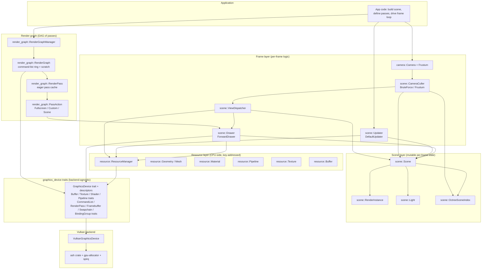
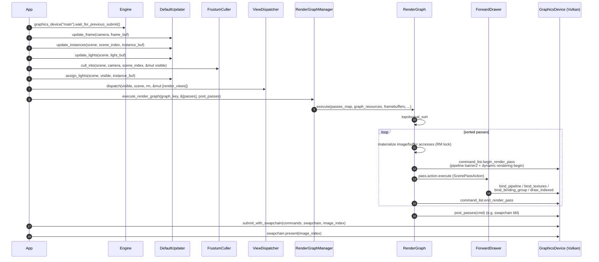
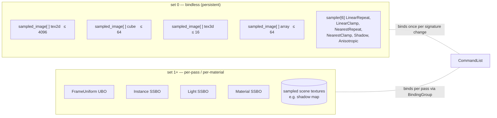
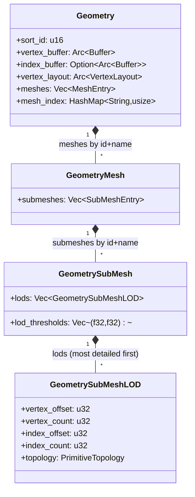
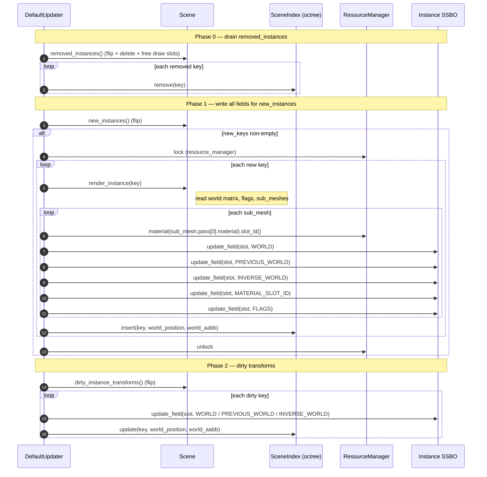
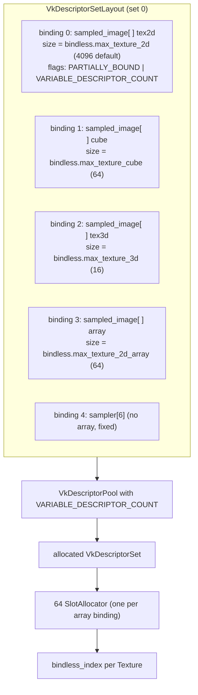
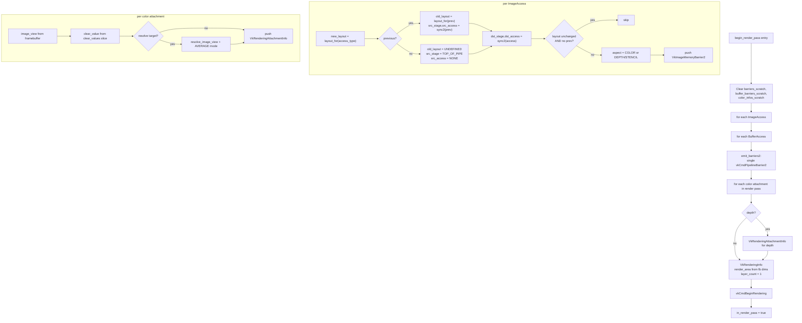

# Galaxy3D Engine — Architecture Reference

> **Scope.** A complete technical reference for the Galaxy3D Engine and its Vulkan backend.
> The document targets engine contributors who already know real-time rendering and want a
> precise map of the codebase: layers, types, lifetimes, threading, allocation patterns,
> sync model, and notable invariants. Every claim is anchored to a file and function name
> (no line numbers — they rot).

> **Repo layout.** Two crates:
> - `galaxy_3d_engine/` — the engine proper (~5500 LOC, no GPU API dependencies beyond traits).
> - `galaxy_3d_engine_renderer_vulkan/` — the Vulkan backend (~3700 LOC) that registers itself
>   as a plugin and implements every `graphics_device` trait.
>
> The engine has no compile-time knowledge of Vulkan. A backend is selected at runtime by
> name through the global `graphics_device_plugin_registry`.

---

## Table of contents

1. [Design philosophy and layered model](#1-design-philosophy-and-layered-model)
2. [Engine singleton](#2-engine-singleton)
3. [Error model and structured logging](#3-error-model-and-structured-logging)
4. [Utilities — SlotAllocator and SwapSet](#4-utilities--slotallocator-and-swapset)
5. [GraphicsDevice abstraction](#5-graphicsdevice-abstraction)
6. [Resource layer — ResourceManager and resource types](#6-resource-layer--resourcemanager-and-resource-types)
7. [Camera and culling](#7-camera-and-culling)
8. [Scene and RenderInstance hierarchy](#8-scene-and-renderinstance-hierarchy)
9. [View dispatch, render queue, drawer](#9-view-dispatch-render-queue-drawer)
10. [Frame state synchronization (Updater)](#10-frame-state-synchronization-updater)
11. [Render graph](#11-render-graph)
12. [Vulkan backend — initialization and shared context](#12-vulkan-backend--initialization-and-shared-context)
13. [Vulkan backend — resources](#13-vulkan-backend--resources)
14. [Vulkan backend — command recording, sync2, swapchain](#14-vulkan-backend--command-recording-sync2-swapchain)
15. [Cross-cutting concerns — performance, threading, unsafe](#15-cross-cutting-concerns--performance-threading-unsafe)
16. [Limitations and open questions](#16-limitations-and-open-questions)

---

## 1. Design philosophy and layered model

### 1.1 Goals

Galaxy3D is a Rust 3D engine designed around four explicit goals:

1. **Backend-agnostic core.** The engine knows nothing about Vulkan. All GPU interactions go
   through the `graphics_device` trait family (`GraphicsDevice`, `Buffer`, `Texture`, `Shader`,
   `Pipeline`, `CommandList`, `RenderPass`, `Framebuffer`, `Swapchain`, `BindingGroup`).
   Backends register at runtime via `graphics_device::register_graphics_device_plugin`.
2. **Zero per-frame allocation in steady state.** Every hot-path data structure (render
   queue, dirty set, scratch barrier list, binding-group resource list, light scoring buffer)
   is preallocated once, then `clear()`+repush per frame. Capacity grows once to its
   high-water mark.
3. **Eager validation over deferred compilation.** The render graph rebuilds pass caches
   *synchronously* at every mutation. Errors (mismatched sample counts, mixed MSAA resolves,
   buffer used as a color attachment) surface at the call site, not at the next frame.
4. **Controlled `unsafe` only at proven invariants.** Every `unwrap_unchecked`,
   `get_unchecked`, raw pointer cast, and `assume_init` is documented inline with a
   `// SAFETY:` block describing the invariant the caller is relying on. The engine has
   *no* `unsafe` blocks outside such sites; the Vulkan backend has one per FFI call.

### 1.2 Layer stack



The engine layers itself top-to-bottom but two cross-cutting concerns reach through every
layer:

- **`Engine` singleton** (`engine::Engine`) holds globals: graphics-device map, the
  `ResourceManager`, the `SceneManager`, the `RenderGraphManager`, plus the `Logger`.
- **`graphics_device::Config`** is consumed by backends at instance creation (validation,
  bindless caps, debug routing).

### 1.3 Frame lifecycle (CPU-side, single-threaded core path)



Note the **lock release point**: `RenderGraph::execute` holds the `ResourceManager` lock
only long enough to clone `Arc` handles into the per-pass image/buffer access lists; the
lock is dropped before any user callback (`PassAction::execute`, `post_passes`) runs.
Drawers and post-pass closures can therefore re-acquire the `ResourceManager` lock
without deadlocking.

### 1.4 Bindless model at a glance

The engine assumes a single bindless descriptor set at **set 0**, populated by the backend
at texture-creation time and rebound when the pipeline layout signature changes. Per-pass
bindings (frame-uniform, instance SSBO, light SSBO, material SSBO) live at **set 1+**,
bound through `BindingGroup` objects owned by `ScenePassAction` or by user code for
fullscreen passes.

Sizes are configured via `graphics_device::BindlessConfig` (default: 4096 2D textures,
64 cubemaps, 16 3D textures, 64 array textures); these are *fixed at initialization*.



Material `texture` parameters do not bind individual descriptors; they store a
**bindless index** that the GPU shader uses to sample directly out of the bindless arrays.

### 1.5 Cross-references between subsystems

| Producer | Consumer | What flows |
|---|---|---|
| `Camera` | `CameraCuller` | view + frustum + viewport |
| `CameraCuller` | `ViewDispatcher`, `DefaultUpdater::assign_lights` | `VisibleInstances { camera, instances: Vec<VisibleInstance> }` |
| `ViewDispatcher` | `Drawer` | per-pass `RenderView { camera, pass_type, items: Vec<VisibleSubMesh> }` |
| `DefaultUpdater` | GPU SSBOs | per-frame uniform + per-instance SSBO + per-light SSBO writes |
| `RenderGraph::execute` | `Drawer::draw` (via `ScenePassAction`) | mutable `CommandList`, immutable `PassInfo` |
| `Drawer` | `CommandList` | bind / draw commands, push constants (instance draw_slot) |

---

## 2. Engine singleton

### 2.1 Static state and initialization

The `Engine` type (`engine::Engine`) is a zero-sized struct exposing static methods. Two
process-wide statics back it up:

```rust
static ENGINE_STATE: OnceLock<EngineState> = OnceLock::new();
static LOGGER: OnceLock<RwLock<Box<dyn Logger>>> = OnceLock::new();
```

`EngineState` holds four `RwLock`-protected fields (`engine::EngineState`):

```rust
struct EngineState {
    graphics_devices: RwLock<FxHashMap<String, Arc<Mutex<dyn GraphicsDevice>>>>,
    resource_manager: RwLock<Option<Arc<Mutex<ResourceManager>>>>,
    scene_manager: RwLock<Option<Arc<Mutex<SceneManager>>>>,
    render_graph_manager: RwLock<Option<Arc<Mutex<RenderGraphManager>>>>,
}
```

**Lifecycle methods:**

- `Engine::initialize()` — calls `ENGINE_STATE.get_or_init(EngineState::new)` once;
  idempotent.
- `Engine::shutdown()` — drains all four collections in *reverse dependency order*
  (RenderGraphManager → SceneManager → ResourceManager → graphics devices). Defensive
  `if let Ok(mut lock) = …` on every `RwLock` so a poisoned lock cannot panic the
  shutdown path.
- `Engine::reset_for_testing()` — `cfg(test)`-gated; identical to `shutdown` but never
  panics. The `OnceLock<EngineState>` itself is *never* re-initializable; only its
  contents are reset.

### 2.2 GraphicsDevice management

Multiple named graphics devices can coexist. The engine code consistently uses
`"main"` as the canonical name, but additional devices (e.g. for compute-only contexts)
can be created on demand.

```rust
Engine::create_graphics_device::<R: GraphicsDevice + 'static>(name, device)
    -> Result<Arc<Mutex<dyn GraphicsDevice>>>
Engine::graphics_device(name) -> Result<Arc<Mutex<dyn GraphicsDevice>>>
Engine::destroy_graphics_device(name) -> Result<()>
Engine::graphics_device_names() -> Vec<String>
Engine::graphics_device_count() -> usize
```

`create_graphics_device` wraps the user-supplied backend value in `Arc<Mutex<…>>`,
inserts it into the map, and returns the Arc for immediate use by the caller. Once
inserted, the engine retains the only canonical handle; the returned Arc is just for
convenience.

The `Arc<Mutex<dyn GraphicsDevice>>` is intentionally non-`Send` from the engine's
perspective: Vulkan command recording is single-threaded by API contract. Multi-threaded
recording would require multiple command pools and is not exposed.

### 2.3 Manager singletons

`ResourceManager`, `SceneManager`, `RenderGraphManager` follow the same pattern:

```rust
Engine::create_resource_manager() -> Result<()>
Engine::resource_manager() -> Result<Arc<Mutex<ResourceManager>>>
Engine::destroy_resource_manager() -> Result<()>
// ditto for scene_manager / render_graph_manager
```

Errors are emitted through `Engine::log_and_return_error`, which logs and returns the
error in one call:

```rust
fn log_and_return_error(error: Error) -> Error {
    match &error {
        Error::InitializationFailed(msg) => engine_error!("galaxy3d::Engine", "Initialization failed: {}", msg),
        Error::BackendError(msg) => engine_error!("galaxy3d::Engine", "Backend error: {}", msg),
        _ => engine_error!("galaxy3d::Engine", "Engine error: {}", error),
    }
    error
}
```

This ensures every Engine error path is observable through the logger without forcing the
caller to log the error themselves.

### 2.4 Plugin registry

The graphics-device plugin registry lives in `graphics_device::graphics_device`:

```rust
type GraphicsDevicePluginFactory = Box<dyn Fn(&Window, Config) -> Result<Arc<Mutex<dyn GraphicsDevice>>> + Send + Sync>;

pub struct GraphicsDevicePluginRegistry {
    plugins: FxHashMap<&'static str, GraphicsDevicePluginFactory>,
}

static GRAPHICS_DEVICE_REGISTRY: Mutex<Option<GraphicsDevicePluginRegistry>> = Mutex::new(None);

pub fn register_graphics_device_plugin<F>(name: &'static str, factory: F)
where F: Fn(&Window, Config) -> Result<Arc<Mutex<dyn GraphicsDevice>>> + Send + Sync + 'static
```

The Vulkan crate's `lib.rs::register` calls this with name `"vulkan"`. The application
then chooses a backend by string name at runtime — there is no compile-time backend
binding.

---

## 3. Error model and structured logging

### 3.1 Error type

`error::Error` (re-exported as `galaxy3d::Error`) has four variants:

| Variant | When |
|---|---|
| `BackendError(String)` | Catch-all rendering or device failure, lock poisoning, plugin call failure |
| `OutOfMemory` | GPU allocation exhausted (reserved; not currently produced by the Vulkan backend, which uses `gpu-allocator` and surfaces failures via `BackendError`) |
| `InvalidResource(String)` | Resource creation rejected by validation |
| `InitializationFailed(String)` | Engine not initialized; manager already exists / not created; plugin not found |

`Result<T> = std::result::Result<T, Error>` is the engine-wide alias.

### 3.2 Logger trait and macros

`log::Logger` is a single-method trait:

```rust
pub trait Logger: Send + Sync {
    fn log(&self, entry: &LogEntry);
}
```

`LogEntry` carries severity, timestamp (`SystemTime`), source string, message, and
optional file+line (used for ERROR level). `LogSeverity` is `Trace < Debug < Info < Warn
< Error`.

`DefaultLogger` writes coloured ANSI to stdout (`colored` crate) with a millisecond
timestamp via `chrono`. Backends or apps can substitute by calling `Engine::set_logger`.

The macro family in `log.rs` is the only sanctioned way to emit logs and propagate
errors:

| Macro | Emits | Returns |
|---|---|---|
| `engine_trace!`, `engine_debug!`, `engine_info!`, `engine_warn!` | `Engine::log` | nothing |
| `engine_error!` | `Engine::log_detailed` (with `file!()`, `line!()`) | nothing |
| `engine_bail!` | `engine_error!` | `return Err(Error::BackendError(...))` from caller |
| `engine_bail_warn!` | `engine_warn!` | `return Err(Error::BackendError(...))` from caller |
| `engine_err!` | `engine_error!` | `Error::BackendError(...)` (rvalue, for use inside closures) |
| `engine_warn_err!` | `engine_warn!` | `Error::BackendError(...)` (rvalue) |

**Rule 7** (per the project's `CLAUDE.md`): *Every error path must be logged.* Bare
`return Err(Error::BackendError(...))` is forbidden in this codebase. The macros enforce
this by combining log + return into one expression.

`Error::InitializationFailed` and `Error::OutOfMemory` are intentional exceptions — they
have their own semantics and are constructed directly, then handed to
`Engine::log_and_return_error`.

### 3.3 Logger global

`LOGGER` is initialized lazily on first `Engine::log` / `Engine::log_detailed` call:

```rust
let logger_lock = LOGGER.get_or_init(|| RwLock::new(Box::new(DefaultLogger)));
if let Ok(lock) = logger_lock.read() {
    lock.log(&LogEntry { ... });
}
```

A poisoned read silently drops the log line — there is no infinite recursion through
error handling.

---

## 4. Utilities — SlotAllocator and SwapSet

### 4.1 SlotAllocator

`utils::slot_allocator::SlotAllocator` allocates `u32` indices for GPU slot tables
(material SSBO slots, light SSBO slots, draw-slot indices for the per-instance SSBO,
bindless texture indices). Its representation:

```rust
pub struct SlotAllocator {
    free_list: Vec<u32>,   // recycled indices, LIFO
    next_id: u32,           // next fresh index
    len: u32,               // currently allocated
}
```

`alloc()` pops `free_list` if non-empty, otherwise issues `next_id` and increments.
`free(id)` pushes onto `free_list` after a debug assertion that `id < next_id`. Both are
`O(1)`. `high_water_mark()` returns `next_id` — the minimum size required for a backing
GPU buffer to never overflow.

**Invariants** (checked in `slot_allocator_tests.rs`):

- `len() <= high_water_mark()` at all times.
- A freed id is reusable on the next alloc.
- The allocator never grows the underlying GPU buffer; the caller is expected to
  preallocate with at least `high_water_mark()` slots.

### 4.2 SwapSet

`utils::swap_set::SwapSet<K>` is a *double-buffered* hash set used for per-frame dirty
tracking. The pattern is "insert during frame N, flip at end of frame N, drain in frame
N+1, while frame N+1 inserts again into the now-cleared front buffer".

```rust
pub struct SwapSet<K> {
    buffers: [FxHashSet<K>; 2],
    empty: FxHashSet<K>,            // sentinel returned when frame was idle
    active: Cell<u8>,                // 0 or 1
    pending_clear: Cell<bool>,       // true between flip() and next insert()
}
```

Methods:

- `insert(&mut self, key)` — clears the front buffer if `pending_clear`, then inserts
  into the active buffer.
- `flip(&self) -> &FxHashSet<K>` — flips the active index *via `Cell`* (no `&mut self`
  required), returns a reference to the *previously active* buffer, or to the `empty`
  sentinel if no insert happened since the last flip. This is what makes the API useful
  on shared types (`Scene::dirty_instance_transforms` is `&self`).
- `remove`, `contains`, `len`, `is_empty` — return logically empty state if
  `pending_clear` is true; otherwise consult the active buffer.
- `clear` — wipes both buffers.

The Cell<u8> pattern is **single-threaded by contract**: SwapSet is `!Send` and `!Sync`.
The `Scene` that owns it is itself behind a `Mutex` at the Engine level, so no race.

`Scene` uses `SwapSet<RenderInstanceKey>` and `SwapSet<LightKey>` for six independent
dirty tracks (instances: dirty-transform / new / removed; lights: dirty-transform /
dirty-data / new / removed).

---

## 5. GraphicsDevice abstraction

The `graphics_device` module is the entire backend-facing surface of the engine. It is
deliberately conservative: every type is a `pub trait`, a `pub struct` descriptor, or a
`pub enum`. No backend-specific concept (Vulkan handles, descriptor-set layouts as
separate objects, queue family indices) leaks through.

### 5.1 GraphicsDevice trait

```rust
pub trait GraphicsDevice: Send + Sync {
    fn create_texture(&mut self, desc: TextureDesc) -> Result<Arc<dyn Texture>>;
    fn create_buffer(&mut self, desc: BufferDesc) -> Result<Arc<dyn Buffer>>;
    fn create_shader(&mut self, desc: ShaderDesc) -> Result<Arc<dyn Shader>>;
    fn create_pipeline(&mut self, desc: PipelineDesc, vs: &Arc<dyn Shader>, fs: &Arc<dyn Shader>) -> Result<Arc<dyn Pipeline>>;
    fn create_command_list(&self) -> Result<Box<dyn CommandList>>;
    fn create_framebuffer(&self, desc: &FramebufferDesc) -> Result<Arc<dyn Framebuffer>>;
    fn create_render_pass(&self, desc: &RenderPassDesc) -> Result<Arc<dyn RenderPass>>;
    fn create_swapchain(&self, window: &Window) -> Result<Box<dyn Swapchain>>;
    fn create_binding_group(&self, pipeline: &Arc<dyn Pipeline>, set_index: u32, resources: &[BindingResource]) -> Result<Arc<dyn BindingGroup>>;
    fn create_binding_group_from_layout(&self, layout: &BindingGroupLayoutDesc, set_index: u32, resources: &[BindingResource]) -> Result<Arc<dyn BindingGroup>>;
    fn submit(&self, commands: &[&dyn CommandList]) -> Result<()>;
    fn submit_with_swapchain(&self, commands: &[&dyn CommandList], swapchain: &dyn Swapchain, image_index: u32) -> Result<()>;
    fn wait_idle(&self) -> Result<()>;
    fn wait_for_previous_submit(&self) -> Result<()>;
    fn stats(&self) -> GraphicsDeviceStats;
    fn resize(&mut self, width: u32, height: u32);
}
```

All resource creators return `Arc<dyn Trait>` — the backend retains internal references
through its own state, but Rust ownership is shared. A texture lives until the last
`Arc<dyn Texture>` is dropped.

### 5.2 Resource traits

```rust
pub trait Buffer: Send + Sync {
    fn update(&self, offset: u64, data: &[u8]) -> Result<()>;
    fn mapped_ptr(&self) -> Option<*mut u8>;
}

pub trait Texture: Send + Sync {
    fn info(&self) -> &TextureInfo;
    fn bindless_index(&self) -> u32;
    fn update(&self, layer: u32, mip_level: u32, data: &[u8]) -> Result<()>;
}

pub trait Shader: Send + Sync {
    fn reflected_bindings(&self) -> &[ReflectedBinding];
    fn reflected_push_constants(&self) -> &[ReflectedPushConstant];
}

pub trait Pipeline: Send + Sync {
    fn binding_group_layout_count(&self) -> u32;
    fn reflection(&self) -> &PipelineReflection;
}

pub trait CommandList { /* see §5.3 */ }
pub trait RenderPass: Send + Sync {}
pub trait Framebuffer: Send + Sync { fn width(&self) -> u32; fn height(&self) -> u32; }
pub trait Swapchain: Send + Sync { /* acquire / present / recreate / format / dimensions */ }
pub trait BindingGroup: Send + Sync { fn set_index(&self) -> u32; }
```

The `RenderPass` trait is empty — it's a marker for opaque backend handles. With dynamic
rendering (Vulkan 1.3) the actual VkRenderPass object is never created; the `RenderPass`
holds only its `RenderPassDesc` metadata.

### 5.3 CommandList trait

```rust
pub trait CommandList: Send + Sync {
    fn begin(&mut self) -> Result<()>;
    fn end(&mut self) -> Result<()>;
    fn begin_render_pass(&mut self,
        render_pass: &Arc<dyn RenderPass>,
        framebuffer: &Arc<dyn Framebuffer>,
        clear_values: &[ClearValue],
        image_accesses: &[ImageAccess],
        buffer_accesses: &[BufferAccess]) -> Result<()>;
    fn end_render_pass(&mut self) -> Result<()>;
    fn bind_pipeline(&mut self, pipeline: &Arc<dyn Pipeline>) -> Result<()>;
    fn bind_vertex_buffer(&mut self, buffer: &Arc<dyn Buffer>, offset: u64) -> Result<()>;
    fn bind_index_buffer(&mut self, buffer: &Arc<dyn Buffer>, offset: u64, t: IndexType) -> Result<()>;
    fn bind_textures(&mut self) -> Result<()>;
    fn bind_binding_group(&mut self, pipeline: &Arc<dyn Pipeline>, set_index: u32, group: &Arc<dyn BindingGroup>) -> Result<()>;
    fn draw(&mut self, vertex_count: u32, first_vertex: u32) -> Result<()>;
    fn draw_indexed(&mut self, index_count: u32, first_index: u32, vertex_offset: i32) -> Result<()>;
    fn set_viewport(&mut self, viewport: Viewport) -> Result<()>;
    fn set_scissor(&mut self, scissor: Rect2D) -> Result<()>;
    fn push_constants(&mut self, stages: ShaderStageFlags, offset: u32, data: &[u8]) -> Result<()>;
    fn set_dynamic_state(&mut self, state: &DynamicRenderState) -> Result<()>;
}
```

Notable design choices:

- **`begin_render_pass` carries the access lists.** The render graph hands the backend the
  full set of `ImageAccess` and `BufferAccess` records that this pass needs, including
  the *previous* access for each resource. The backend folds these into a *single*
  `vkCmdPipelineBarrier2` and the `vkCmdBeginRendering` call. There is no separate
  `transition_image_layout` API.
- **`bind_textures()` is a single method** — it binds set 0 (the bindless set) to
  whatever pipeline is currently bound. The backend caches the bindless set so this is
  cheap.
- **`set_dynamic_state(&DynamicRenderState)`** — one call sets cull, front face, depth
  test/write/compare/bias/bounds, stencil ops/masks/refs, and blend constants. The
  alternative (separate `cmd_set_*` calls) would inflate command-list code in the engine
  for marginal benefit.

### 5.4 Descriptors and binding model

`BindingType` is the engine-side resource enum: `UniformBuffer`,
`CombinedImageSampler`, `StorageBuffer`. (The "combined image sampler" naming follows
GLSL/Vulkan; in practice the engine routes the sampler through the bindless `sampler[6]`
array and so the texture binding is technically a separate `sampled_image`.)

`ShaderStageFlags` is a packed `u32` (`VERTEX=0x01`, `FRAGMENT=0x02`, `COMPUTE=0x04`)
with helpers `from_stages(&[ShaderStage])`, `from_bits(u32)`, `contains_vertex/fragment/
compute()`, `bits()`. Predefined constants: `VERTEX`, `FRAGMENT`, `COMPUTE`,
`VERTEX_FRAGMENT`, `ALL`.

`BindingSlotDesc { binding, binding_type, count, stage_flags }` describes one descriptor
slot. `BindingGroupLayoutDesc { entries: Vec<BindingSlotDesc> }` is the full layout.

`BindingResource<'a>` is the *concrete* binding payload at group-creation time:

```rust
pub enum BindingResource<'a> {
    UniformBuffer(&'a dyn Buffer),
    SampledTexture(&'a dyn Texture, SamplerType),
    StorageBuffer(&'a dyn Buffer),
}
```

The backend uses `BindingResource::SampledTexture(_, SamplerType::Anisotropic)` to tell
the descriptor-write code which sampler index to pair with the texture. The texture
itself is resolved through its `bindless_index()`.

### 5.5 PipelineReflection and PipelineSignatureKey

`PipelineReflection` is built once at backend pipeline creation and stored on the
`Pipeline` object. It exposes:

```rust
fn bindings(&self) -> &[ReflectedBinding];
fn binding(&self, index: usize) -> Option<&ReflectedBinding>;            // O(1) by index
fn binding_by_name(&self, name: &str) -> Option<&ReflectedBinding>;      // O(1) via FxHashMap
fn binding_index(&self, name: &str) -> Option<usize>;
fn binding_count(&self) -> usize;
fn push_constants(&self) -> &[ReflectedPushConstant];
fn push_constant_count(&self) -> usize;
```

`ReflectedBinding { name, set, binding, binding_type, stage_flags, members }` mirrors
SPIR-V binding metadata. `members` is filled for UBO/SSBO blocks (recursive
`ReflectedMemberType::Scalar/Vector/Matrix/Array/Struct`), empty for sampled images and
storage images.

`PipelineSignatureKey` is the *layout-compatibility* key derived from the reflection:

```rust
pub struct PipelineSignatureKey {
    pub descriptor_sets: Vec<DescriptorSetSignature>,         // sorted by set index
    pub push_constant_ranges: Vec<PushConstantRangeSignature>, // sorted by (stage_bits, offset)
}

pub struct DescriptorSetSignature {
    pub set: u32,
    pub bindings: Vec<BindingSignature>,                       // sorted by binding index
}
```

Two pipelines with identical `PipelineSignatureKey` are *layout-compatible* per Vulkan
§14.2.2 — descriptor sets bound for one are valid for the other. The forward drawer uses
this fact to avoid rebinding set 0 / set 1 across consecutive pipelines that share the
same signature.

### 5.6 DynamicRenderState

`DynamicRenderState` is the per-draw mutable state that *isn't* baked into the pipeline:

```rust
pub struct DynamicRenderState {
    pub cull_mode: CullMode,
    pub front_face: FrontFace,
    pub depth_test_enable: bool,
    pub depth_write_enable: bool,
    pub depth_compare_op: CompareOp,
    pub depth_bias_enable: bool,
    pub depth_bias: DepthBias,                     // constant_factor, slope_factor, clamp
    pub depth_bounds_test_enable: bool,
    pub depth_bounds_min: f32,
    pub depth_bounds_max: f32,
    pub stencil_test_enable: bool,
    pub stencil_front: StencilOpState,
    pub stencil_back: StencilOpState,
    pub blend_constants: [f32; 4],
}
```

Crucially, **blend mode is *not* dynamic**. `ColorBlendState { blend_enable, src/dst
factors, blend op, color_write_mask, color_write_enable }` is part of `PipelineDesc`. The
reasoning is documented inline: tile-based GPUs (ARM Mali, Qualcomm Adreno) emit shader
recompiles when blend mode changes, so making it dynamic would be a footgun.

`DynamicRenderStateKey` is the hashable counterpart, storing every `f32` field as
`f32::to_bits() -> u32`. This is used by `ResourceManager` to deduplicate identical
material render states and assign each one a stable `render_state_signature_id: u16`,
which the drawer uses as part of the sort key to skip redundant `set_dynamic_state`
calls.

### 5.7 AccessType, ImageAccess, BufferAccess

`AccessType` is a small enum (11 variants) describing how a pass uses a resource:
`ColorAttachmentWrite/Read`, `DepthStencilWrite/ReadOnly`, `FragmentShaderRead`,
`VertexShaderRead`, `ComputeRead/Write`, `TransferRead/Write`, `RayTracingRead`.
Helpers `is_write()` and `is_attachment()` drive the topological-sort writer-before-
reader logic and the framebuffer attachment classification.

`ImageAccess { texture: Arc<dyn Texture>, access_type, previous_access_type: Option<…> }`
and `BufferAccess { buffer, access_type, previous_access_type }` are the per-pass access
records that travel with `begin_render_pass`. `previous_access_type` is computed by the
render graph at frame execute time (see §11.4).

### 5.8 Texture and buffer descriptors

`TextureFormat` covers the typical render-graph palette: `R8G8B8A8_SRGB/UNORM`,
`B8G8R8A8_SRGB/UNORM`, `R16G16B16A16_SFLOAT`, plus depth (`D16_UNORM`, `D32_FLOAT`,
`D24_UNORM_S8_UINT`, `D32_FLOAT_S8_UINT`). `bytes_per_pixel()` returns 2/4/8.

`TextureUsage`: `Sampled`, `RenderTarget`, `SampledAndRenderTarget`, `DepthStencil`.

`TextureType`: `Tex2D` or `Array2D`. (Cube and 3D textures are bindless-class-aware but
not first-class in `TextureType`; the backend adds these on the bindless side.)

`TextureData`: `Single(Vec<u8>)` for simple textures, `Layers(Vec<TextureLayerData>)` for
array textures with partial uploads.

`MipmapMode`: `None`, `Generate { max_levels }`, `Manual(ManualMipmapData)`.
`MipmapMode::mip_levels(width, height)` computes the resulting count;
`max_mip_levels(w, h) = floor(log2(max(w, h))) + 1`.

`SamplerType`: six predefined samplers (`LinearRepeat`, `LinearClamp`, `NearestRepeat`,
`NearestClamp`, `Shadow`, `Anisotropic`). The backend caches these as a fixed table at
init.

`BufferDesc { size: u64, usage: BufferUsage }` where `BufferUsage` is `Vertex`, `Index`,
`Uniform`, `Storage`. Buffer formats for vertex attributes are a separate enum
`BufferFormat` (R32_SFLOAT, R32G32_SFLOAT, …, R8G8B8A8_UINT) used in `VertexAttribute`.

### 5.9 Configuration

`Config` holds startup options:

```rust
pub struct Config {
    pub enable_validation: bool,                  // cfg!(debug_assertions) by default
    pub app_name: String,                         // "Galaxy3D Application"
    pub app_version: (u32, u32, u32),             // (1, 0, 0)
    pub debug_severity: DebugSeverity,            // ErrorsAndWarnings (debug) / ErrorsOnly (release)
    pub debug_output: DebugOutput,                // Console / File(path) / Both(path)
    pub debug_message_filter: DebugMessageFilter, // show_general / validation / performance
    pub break_on_validation_error: bool,
    pub panic_on_error: bool,
    pub enable_validation_stats: bool,
    pub bindless: BindlessConfig,                 // 4096 / 64 / 16 / 64
}
```

`ValidationStats { errors, warnings, info, verbose }` is incremented by the debug
callback in the Vulkan backend.

---

## 6. Resource layer — ResourceManager and resource types

### 6.1 ResourceManager overview

`resource::resource_manager::ResourceManager` is the central CPU-side resource registry.
It uses `slotmap::SlotMap<Key, Arc<T>>` plus a parallel `FxHashMap<String, Key>` name
index for each resource kind:

| Kind | Key | Storage |
|---|---|---|
| Texture | `TextureKey` | `SlotMap<TextureKey, Arc<Texture>>` + name map |
| Geometry | `GeometryKey` | same pattern |
| Shader | `ShaderKey` | same pattern |
| Pipeline | `PipelineKey` | same pattern |
| Material | `MaterialKey` | same pattern |
| Mesh | `MeshKey` | same pattern |
| Buffer | `BufferKey` | same pattern |

Stable `slotmap` keys survive removal: `TextureKey::default()` is a null key but a
non-null key remains valid even if other textures are removed; only its own removal
invalidates it.

The ResourceManager exposes the following accessor pattern *uniformly* across all
seven kinds (per the project's naming convention, `CLAUDE.md` rule):

```rust
pub fn texture(&self, key: TextureKey) -> Option<&Arc<Texture>>;       // hot path, O(1)
pub fn texture_by_name(&self, name: &str) -> Option<&Arc<Texture>>;    // lookup, O(1)
pub fn texture_key(&self, name: &str) -> Option<TextureKey>;
pub fn texture_count(&self) -> usize;
pub fn create_texture(&mut self, name: String, desc: TextureDesc) -> Result<TextureKey>;
pub fn remove_texture(&mut self, key: TextureKey) -> bool;
pub fn remove_texture_by_name(&mut self, name: &str) -> bool;
```

Beyond the seven kinds, `ResourceManager` also owns:

- `material_slot_allocator: SlotAllocator` — assigns each `Material` a `slot_id`
  for indexing into the material SSBO. Slots are recycled when materials are removed.
- `pipeline_cache: FxHashMap<PipelineCacheKey, PipelineKey>` — deduplicates pipelines
  resolved from `(vertex_shader, fragment_shader, vertex_layout, topology, color_blend,
  polygon_mode, color_formats, depth_format, sample_count)`.
- `pipeline_signatures: FxHashMap<PipelineSignatureKey, u16>` and
  `next_pipeline_signature_id: u16` — assigns each unique pipeline-layout signature a
  16-bit id used in the drawer's sort key.
- `material_render_state_signatures: FxHashMap<DynamicRenderStateKey, u16>` and
  `next_render_state_signature_id: u16` — the equivalent for dynamic-state
  deduplication.

### 6.2 PassInfo and generation counter

`resource::resource_manager::PassInfo` bundles attachment metadata for a render pass:

```rust
pub struct PassInfo {
    pub color_formats: Vec<TextureFormat>,
    pub depth_format: Option<TextureFormat>,
    pub sample_count: SampleCount,
    generation: u64,
}
```

The `generation` field is the cornerstone of pipeline cache invalidation. Whenever a
`RenderGraphManager` rebuilds a pass cache and the new color/depth formats or sample
count differ from the previous, `PassInfo::increment_generation()` ensures the new
generation is *strictly greater* than the previous one. Pipeline caches stored on
`RenderSubMeshPass` carry `(cached_pass_info_gen, cached_material_gen)` and a cached
entry is valid only if both numbers match the current `pass_info.generation()` and
`material.generation()`.

### 6.3 Buffer wrapper (resource::Buffer)

The resource-level `Buffer` is a *typed wrapper* around `graphics_device::Buffer` with
field metadata describing the structured layout (UBO or SSBO):

```rust
pub struct Buffer {
    graphics_device_buffer: Arc<dyn graphics_device::Buffer>,
    kind: BufferKind,                              // Uniform or Storage
    fields: Vec<FieldDesc>,
    field_index: FxHashMap<String, usize>,
    field_offsets: Vec<u64>,                       // computed std140 / std430 offsets
    element_stride: u64,                            // total size per element
    element_count: u32,
}

pub enum BufferKind { Uniform, Storage }
pub struct FieldDesc { pub name: String, pub field_type: FieldType }

pub enum FieldType {
    Float, Vec2, Vec3, Vec4, Mat3, Mat4, Int, UInt, UVec4,
}

impl FieldType {
    pub fn size_bytes(&self) -> u64 { /* std140-correct: Vec3=16, Mat3=48, etc. */ }
    pub fn alignment(&self) -> u64  { /* 4 / 8 / 16 according to std140 */ }
}
```

Layout is computed once at construction following std140 rules (UBO) or std430 rules
(SSBO). Each field is aligned to its natural alignment, the struct stride is rounded up
to the largest field alignment.

`update_field(index: u32, field_index: usize, data: &[u8])` writes a single field of a
single element with an alignment-aware offset; it forwards to the backend's `Buffer::
update`. There is no allocation on the hot path.

`field_id(name)` is the name-to-index resolver (used during `ResourceManager::
create_default_*_buffer` constructors).

### 6.4 Default GPU buffer factories

The ResourceManager exposes four "default" buffer factories that pre-define the engine's
canonical SSBO/UBO layouts. Drawers, updaters, and bindless metadata code reference
fixed field indices (declared as private constants on `DefaultUpdater` /
`ResourceManager`).

#### Frame uniform buffer (16 fields, UBO)

`create_default_frame_uniform_buffer(name, gd) -> BufferKey`:

| idx | name | type | default written by factory |
|---|---|---|---|
| 0 | `view` | Mat4 | identity |
| 1 | `projection` | Mat4 | identity |
| 2 | `viewProjection` | Mat4 | identity |
| 3 | `cameraPosition` | Vec4 | (0, 0, 0, 1) |
| 4 | `cameraDirection` | Vec4 | (0, 0, -1, 0) |
| 5 | `sunDirection` | Vec4 | (0, -1, 0, 0) |
| 6 | `sunColor` | Vec4 | (1, 1, 1, 1) |
| 7 | `ambientColor` | Vec4 | (0.1, 0.1, 0.1, 1) |
| 8 | `time` | Float | 0 |
| 9 | `deltaTime` | Float | 0 |
| 10 | `frameIndex` | UInt | 0 |
| 11 | `exposure` | Float | 1.0 |
| 12 | `gamma` | Float | 2.2 |
| 13 | `nearPlane` | Float | 0.1 |
| 14 | `farPlane` | Float | 1000.0 |
| 15 | `ambientIntensity` | Float | 1.0 |

Indices 0-4 are written every frame by `DefaultUpdater::update_frame`. The remaining
fields can be updated by app code or left at the factory defaults.

#### Per-instance SSBO (9 fields)

`create_default_instance_buffer(name, gd, count) -> BufferKey`:

| idx | name | type | meaning |
|---|---|---|---|
| 0 | `world` | Mat4 | per-instance world transform |
| 1 | `previousWorld` | Mat4 | previous frame's world (motion vectors / TAA) |
| 2 | `inverseWorld` | Mat4 | inverse world (normal transforms) |
| 3 | `materialSlotId` | UInt | index into material SSBO |
| 4 | `flags` | UInt | `FLAG_VISIBLE | FLAG_CAST_SHADOW | FLAG_RECEIVE_SHADOW` |
| 5 | `lightCount` | UInt | per-instance assigned-lights count (≤ 8) |
| 6 | `customData` | Vec4 | reserved |
| 7 | `lightIndices0` | UVec4 | first 4 light slots (0xFFFFFFFF = empty) |
| 8 | `lightIndices1` | UVec4 | next 4 light slots |

Slot 0..count is preallocated. Indices 7-8 are pre-filled with `0xFFFFFFFF` sentinels so
that a zero-`lightCount` is unambiguous. `DefaultUpdater::update_instances` writes
fields 0-4 on new and dirty instances; `assign_lights` writes 5, 7, 8 after culling.

#### Material SSBO (PBR layout)

`create_default_material_buffer(name, gd, count) -> BufferKey`. The factory creates
fields for typical PBR parameters (`baseColor`, `emissiveColor`, `metallic`,
`roughness`, `normalScale`, `ao`, `alphaCutoff`, `ior`) plus five texture slots, each
expressed as three fields `<name>Texture` (UInt, the bindless index), `<name>Sampler`
(UInt, the sampler index), `<name>Layer` (UInt, the array-layer index for atlases).
Slots: `albedo`, `normal`, `metallicRoughness`, `emissive`, `ao`.

`ResourceManager::sync_materials_to_buffer(buffer)` walks every material and writes its
parameters and texture-slot bindless indices into the buffer at offset
`material.slot_id() * stride`. Calling this once per frame (or on dirty) keeps the GPU
material SSBO in sync.

#### Light SSBO (5 Vec4 fields)

`create_default_light_buffer(name, gd, count) -> BufferKey`:

| idx | name | encoding |
|---|---|---|
| 0 | `positionType` | (pos.x, pos.y, pos.z, type) — type=0 for Point, 1 for Spot |
| 1 | `directionRange` | (dir.x, dir.y, dir.z, range) |
| 2 | `colorIntensity` | (r, g, b, intensity) |
| 3 | `spotParams` | (innerAngle, outerAngle, 0, 0) |
| 4 | `attenuation` | (constant, linear, quadratic, 0) |

Default values: spotParams=(0, 0, 0, 0), attenuation=(0, 0, 1, 0) — inverse-square
attenuation by default. `DefaultUpdater::update_lights` writes these in three sub-phases
(see §10.3).

### 6.5 Geometry hierarchy



Key points:

- The `vertex_buffer` and `index_buffer` are owned by the `Geometry` and *shared* across
  all submeshes via offset/count slicing. There is one big VBO + IBO per `Geometry`, not
  one per submesh.
- `vertex_layout: Arc<VertexLayout>` is shared via `Arc` so the pipeline-resolve cache
  can hash by Arc-content equality without cloning the layout.
- LODs are stored *most-detailed first* (`lods[0]` is highest detail). `lod_thresholds`
  is a `Vec<(f32, f32)>` of `(drop_threshold, raise_threshold)` pairs — one per
  *frontier* between consecutive LODs (length = `lods.len() - 1`).
- Each `Geometry` receives a unique `sort_id: u16` from a global counter on the
  ResourceManager. Drawers use this id as a sort-key component to group draws sharing
  the same vertex/index buffers.

### 6.6 Material model

```rust
pub struct Material {
    slot_id: u32,                                 // index into material SSBO
    passes: Vec<MaterialPass>,                    // one entry per pass_type
    pass_index: HashMap<u8, usize>,               // pass_type -> index in passes
    generation: u64,                              // cache invalidation
}

pub struct MaterialPass {
    pub pass_type: u8,                            // < 64 (matches Scene::pass_mask bits)
    fragment_shader: ShaderKey,
    color_blend: ColorBlendState,
    polygon_mode: PolygonMode,
    render_state: DynamicRenderState,
    render_state_signature_id: u16,               // assigned by ResourceManager
    textures: Vec<MaterialTextureSlot>,
    texture_index: HashMap<String, usize>,
    params: Vec<MaterialParam>,
    param_index: HashMap<String, usize>,
}

pub enum ParamValue {
    Float(f32), Vec2([f32; 2]), Vec3([f32; 3]), Vec4([f32; 4]),
    Int(i32), UInt(u32), Bool(bool),
    Mat3([f32; 9]), Mat4([f32; 16]),
}
```

Notable design choices:

- A `Material` has *multiple passes* indexed by `pass_type`. The renderer can ask for
  pass 0 (gbuffer), pass 1 (shadow), pass 2 (transparent forward), etc., with each pass
  carrying its own fragment shader, blend state, polygon mode, dynamic state, textures,
  and parameters.
- Texture slots store the `bindless_index` of the texture, the `sampler_index` (= the
  `SamplerType` cast to `u32`), and the resolved layer/region indices.
- `render_state_signature_id` is assigned by `ResourceManager::create_material` after
  hashing the `DynamicRenderState` via `DynamicRenderStateKey`. Two passes with
  identical state share the same id; the drawer skips redundant
  `cmd.set_dynamic_state(...)` calls when the id is unchanged across consecutive draws.
- `generation: u64` is bumped on parameter changes that affect the GPU layout (texture
  swap, etc.). The `RenderSubMeshPass` pipeline cache checks both `pass_info.generation`
  and `material.generation` for validity.

### 6.7 Mesh assembly

`resource::Mesh` is the renderable composition layer:

```rust
pub struct Mesh {
    geometry: GeometryKey,                          // points to a Geometry
    geometry_mesh_id: usize,                        // selects one GeometryMesh inside
    submeshes: Vec<MeshSubMesh>,                    // one per submesh of that GeometryMesh
}

pub struct MeshSubMesh {
    submesh_id: usize,                              // index inside the GeometryMesh
    material: MaterialKey,                          // material to render with
}
```

`MeshDesc` accepts either name or index for both the mesh-within-geometry and each
submesh-within-mesh:

```rust
pub enum GeometryMeshRef { Name(String), Index(usize) }
pub enum GeometrySubMeshRef { Name(String), Index(usize) }
```

`Mesh::from_desc` resolves names against the `GeometryMesh` definitions, validates that
every submesh of the GeometryMesh has a matching `MeshSubMeshDesc`, and stores resolved
indices for O(1) access at draw time.

### 6.8 Pipeline resolve cache

`ResourceManager::resolve_pipeline` is the slow-path entry into pipeline creation:

```rust
pub fn resolve_pipeline(
    &mut self,
    vertex_shader: ShaderKey,
    fragment_shader: ShaderKey,
    vertex_layout: Arc<VertexLayout>,
    topology: PrimitiveTopology,
    color_blend: &ColorBlendState,
    polygon_mode: PolygonMode,
    pass_info: &PassInfo,
    gd: &mut dyn graphics_device::GraphicsDevice,
) -> Result<PipelineKey>
```

The `PipelineCacheKey` covers everything that affects the pipeline state object: shader
keys, vertex-layout content (Arc-hashed by inner content), topology, blend state,
polygon mode, color formats, depth format, sample count.

On a cache hit, the existing `PipelineKey` is returned. On a miss, the function calls
`gd.create_pipeline`, stores the result under an auto-generated name
`_cache_{hash:016X}`, indexes it in the cache, and returns the new key. There is no
eviction; in practice the cache size is bounded by the unique combinations the
application actually uses.

The drawer always goes through `resolve_pipeline`; manual `create_pipeline` calls are
typically only used for fullscreen passes that don't pass through the cache logic.

### 6.9 Pipeline and shader wrappers

`resource::Pipeline` is a thin wrapper around `graphics_device::Pipeline`:

```rust
pub struct Pipeline {
    graphics_device_pipeline: Arc<dyn graphics_device::Pipeline>,
    vertex_shader: ShaderKey,
    fragment_shader: ShaderKey,
    signature_id: u16,                              // shared by layout-compatible pipelines
    sort_id: u16,                                   // unique per Pipeline resource
}
```

`signature_id` is assigned via the `pipeline_signatures` cache (lookup by
`PipelineSignatureKey::from_reflection`). Pipelines with the same signature share
descriptor-set layouts and can re-use bound descriptor sets.

`sort_id` is unique per `Pipeline` resource and used as one of the four 16-bit
components of the drawer's 64-bit sort key.

`resource::Shader` is similar — a `Arc<dyn graphics_device::Shader>` plus the original
`stage` and `entry_point`.

### 6.10 Texture resource

`resource::Texture` wraps a `graphics_device::Texture` plus an optional atlas region map
and per-layer name index. It is constructed from a `resource::TextureDesc`:

```rust
pub struct TextureDesc {
    pub graphics_device: Arc<Mutex<dyn graphics_device::GraphicsDevice>>,
    pub texture: graphics_device::TextureDesc,
    pub layers: Vec<LayerDesc>,
}

pub struct LayerDesc {
    pub name: String,
    pub layer_index: u32,
    pub data: Option<Vec<u8>>,
    pub regions: Vec<AtlasRegionDesc>,
}

pub struct AtlasRegion {
    pub x: u32, pub y: u32, pub width: u32, pub height: u32,
}
```

Validation rules enforced in `Texture::from_desc`:

- Simple textures (`array_layers == 1`) must have exactly one layer with `layer_index = 0`.
- `Tex2D` cannot have `array_layers > 1` (use `Array2D`).
- Layer indices must be in range, unique, and not duplicated by name.
- Atlas regions must fit inside the texture and have non-zero dimensions.

Atlas regions are queryable by name through `texture.region_id(layer_name, region_name)`
returning the resolved `(layer_index, x, y, width, height)`.

---

## 7. Camera and culling

### 7.1 Camera (passive data carrier)

`camera::Camera` is a passive struct: it stores precomputed matrices and viewport state,
but performs no math beyond `view_projection_matrix() = projection * view`.

```rust
pub struct Camera {
    view_matrix: Mat4,
    projection_matrix: Mat4,
    frustum: Frustum,                               // derived from view_projection
    viewport: Viewport,
    scissor: Option<Rect2D>,
}

pub fn effective_scissor(&self) -> Rect2D {
    self.scissor.unwrap_or_else(|| Rect2D {
        x: self.viewport.x as i32,
        y: self.viewport.y as i32,
        width: self.viewport.width as u32,
        height: self.viewport.height as u32,
    })
}
```

`Camera::new(view, projection, frustum, viewport)` and the various `set_*` methods are
the only public mutation points. The frustum is held alongside the matrices so that
culling does not have to recompute it.

`viewport` matches the Vulkan layout (`x, y, width, height, min_depth, max_depth`); it
flows through `RenderView` and is set per-pass by the drawer via `cmd.set_viewport`.

### 7.2 Frustum

`camera::frustum::Frustum` stores six planes as `[Vec4; 6]` in `(left, right, bottom,
top, near, far)` order:

```rust
pub struct Frustum {
    planes: [Vec4; 6],
}
```

Plane equation: `Ax + By + Cz + D = 0`. Normals point *inward*; a point `P` is inside
the half-space if `dot(plane.xyz, P) + plane.w >= 0`.

`Frustum::from_view_projection(vp: &Mat4)` uses the Gribb–Hartmann extraction: each
plane is a row addition/subtraction of the view-projection matrix, then normalized so
the normal is unit length. Works identically for perspective and orthographic
projections.

`intersects_aabb(&AABB) -> bool` uses the *positive-vertex* trick: for each plane,
choose the AABB corner most aligned with the inward normal. If that corner is outside
the half-space, the AABB is fully outside. This is conservative (may report some
false-positive intersections that are actually outside diagonally, but never false
negatives).

`classify_aabb(&AABB) -> FrustumClassify` returns `Inside`, `Outside`, or `Partial` for
hierarchical (octree) culling — both the positive vertex *and* the negative vertex are
tested per plane.

### 7.3 LOD math

`camera::lod::project_sphere_diameter(center: Vec3, radius: f32, camera: &Camera) -> f32`
returns the screen-space pixel diameter of a bounding sphere as seen by the camera.

Implementation: clip-space transform of the center, perspective divide, multiply by
viewport height (assumes vertical FOV reference). Behind-camera spheres clamp to a
"saturated large" value (so they pick the most-detailed LOD safely; downstream LOD
selection then drops them via frustum culling). Zero-radius spheres yield zero.

The result is fed into `scene::lod::apply_hysteresis(current_lod, screen_size,
thresholds)` (see §8.6).

### 7.4 VisibleInstances

`camera::VisibleInstances` is the *output buffer* of culling and *input buffer* of the
view dispatcher and updater's light-assignment phase:

```rust
pub struct VisibleInstances {
    camera: Camera,
    instances: Vec<VisibleInstance>,
}

pub struct VisibleInstance {
    pub key: RenderInstanceKey,
    pub distance: f32,                              // view-space depth
}
```

`new_empty()` creates an empty buffer with default camera. The culler calls
`set_camera(camera.clone())` and `clear_instances()` (preserves capacity), then pushes
each visible instance. Zero allocation in steady state once the high-water mark of
visible instances is reached.

### 7.5 Cullers

`scene::CameraCuller` is the trait abstracting culling strategies:

```rust
pub trait CameraCuller: Send + Sync {
    fn cull_into(
        &mut self,
        scene: &Scene,
        camera: &Camera,
        scene_index: Option<&dyn SceneIndex>,
        visible: &mut VisibleInstances,
    );
}
```

The `&mut self` receiver allows stateful implementations (e.g. caches across frames).

Two implementations:

1. **`BruteForceCuller`** — returns *all* instances, computing only their view-space
   depth. Useful as a baseline or for very small scenes.
2. **`FrustumCuller`** — performs frustum culling. Without a `SceneIndex`, it walks
   every instance and tests its world-space AABB (`instance.bounding_box().transformed(
   instance.world_matrix())`) against the frustum. With a `SceneIndex`, it delegates to
   `idx.query_frustum(&frustum, camera_pos, camera_forward, visible.instances_mut())`.

Both compute view-space depth via:

```rust
let world = camera.view_matrix().inverse();
let camera_pos = world.w_axis.truncate();
let camera_forward = -world.z_axis.truncate();
let depth = (instance_pos - camera_pos).dot(camera_forward);
```

A negative depth means the instance is behind the camera. Frustum culling removes those
upstream.

### 7.6 OctreeSceneIndex

`scene::octree_scene_index::OctreeSceneIndex` is the spatial-acceleration structure
implementing the `SceneIndex` trait. Design choice: **single-node placement** — each
object is stored in exactly one node, the deepest octant whose AABB fully contains the
object's world AABB. Objects straddling a child boundary remain in the parent. No
duplication, no `HashSet` for query results.

```rust
pub struct OctreeSceneIndex {
    nodes: Vec<OctreeNode>,                         // depth-first, fully preallocated
    max_depth: u32,
    object_locations: FxHashMap<RenderInstanceKey, usize>, // key -> node index
    subtree_sizes: Vec<usize>,                      // size of subtree by remaining depth
}

struct OctreeNode {
    aabb: AABB,
    first_child: usize,                             // 0 = leaf
    objects: Vec<(RenderInstanceKey, Vec3, AABB)>,  // key, world position, world AABB
}
```

Total node count for depth `D`: `(8^(D+1) − 1) / 7`. At depth 4 that's 6553 nodes. The
node array is allocated once at construction; child indices are computed via
`subtree_offset(octant, remaining_depth)` with `subtree_sizes` as a precomputed lookup
table (`O(1)` per descent step).

**Insert** descends from the root: the object's AABB min and max corners are mapped to
octant indices; if both map to the same octant, descend; otherwise the object straddles
a boundary and is stored in the current node.

**Query** is a depth-first traversal with `Frustum::classify_aabb` at each node:

- `Inside` — recursively collect *all* descendant objects without further frustum
  testing (this is the win versus a flat list).
- `Outside` — skip the entire subtree.
- `Partial` — test each object individually; recurse into children.

`update(key, world_pos, world_aabb)` — recomputes the target node and, if different from
`object_locations[key]`, removes from old node and inserts into new. Otherwise updates
in place.

### 7.7 Scene-index trait

The trait surface is minimal:

```rust
pub trait SceneIndex: Send + Sync {
    fn insert(&mut self, key: RenderInstanceKey, world_position: Vec3, world_aabb: &AABB);
    fn update(&mut self, key: RenderInstanceKey, world_position: Vec3, world_aabb: &AABB);
    fn remove(&mut self, key: RenderInstanceKey);
    fn query_frustum(
        &self,
        frustum: &Frustum,
        camera_pos: Vec3,
        camera_forward: Vec3,
        out: &mut Vec<VisibleInstance>,
    );
}
```

`DefaultUpdater` calls `insert` / `update` / `remove` from its three-phase instance sync
(see §10.2). `FrustumCuller` calls `query_frustum`. The engine ships only `OctreeScene
Index` but the trait is open — apps can write their own (BVH, kd-tree).

---

## 8. Scene and RenderInstance hierarchy

### 8.1 Scene struct

`scene::Scene` is the per-frame mutable state container. It does not own resources
(those live in the `ResourceManager`); it owns *instances* — references with state.

```rust
pub struct Scene {
    render_instances: SlotMap<RenderInstanceKey, RenderInstance>,
    draw_slot_allocator: SlotAllocator,             // for instance SSBO slots

    dirty_instance_transforms: SwapSet<RenderInstanceKey>,
    new_instances: SwapSet<RenderInstanceKey>,
    removed_instances: SwapSet<RenderInstanceKey>,

    lights: SlotMap<LightKey, Light>,
    light_slot_allocator: SlotAllocator,            // for light SSBO slots

    new_lights: SwapSet<LightKey>,
    dirty_light_transforms: SwapSet<LightKey>,
    dirty_light_data: SwapSet<LightKey>,
    removed_lights: SwapSet<LightKey>,
}
```

Constructors and dirty-set drainers form a tight contract with the updater:

- `Scene::create_render_instance(mesh_key, world_matrix, bounding_box, vertex_shader,
  vertex_shader_overrides, &resource_manager) -> Result<RenderInstanceKey>` — allocates
  draw slots from `draw_slot_allocator`, builds a `RenderInstance::from_mesh`, inserts
  into the slot map, marks `new_instances`. Three submeshes → three new draw slots.
- `Scene::remove_render_instance(key) -> bool` — adds to `removed_instances`, removes
  from `dirty_instance_transforms` and `new_instances` (deduplication), returns false on
  invalid key. The instance stays in the slot map until `removed_instances()` is
  drained.
- `Scene::set_world_matrix(key, m)` — mutates the matrix and marks `dirty_instance_
  transforms`.

`Scene::new_instances()`, `dirty_instance_transforms()`, `dirty_light_transforms()`,
`dirty_light_data()`, `new_lights()` all call `flip()` and return the *previously
active* dirty buffer. The same SwapSet semantics described in §4.2 apply.

`Scene::removed_instances() -> &FxHashSet<RenderInstanceKey>` flips, drains, and *also*:

```rust
for &key in keys.iter() {
    if let Some(instance) = self.render_instances.get(key) {
        instance.free_draw_slots(&mut self.draw_slot_allocator);
    }
    self.render_instances.remove(key);
}
```

Removing draw slots frees the per-submesh entries in `draw_slot_allocator`. If three
submeshes were allocated at instance creation, three draw slots return to the free list.

`Scene::removed_lights()` is symmetric for the light slot allocator.

### 8.2 SceneManager

`scene::SceneManager` is a singleton wrapper at the Engine layer holding `Option<Arc<
Mutex<Scene>>>`. It exists for the same reasons as `RenderGraphManager`: a global access
point, lazy creation/destruction, and consistent lifecycle.

### 8.3 RenderInstance — top-level

`scene::render_instance::RenderInstance` is the in-scene representation of a renderable
entity:

```rust
pub struct RenderInstance {
    geometry: GeometryKey,                           // resolved from Mesh at construction
    geometry_mesh_id: usize,                         // which GeometryMesh
    sub_meshes: Vec<RenderSubMesh>,                   // one per submesh in the mesh
    world_matrix: Mat4,
    flags: u64,                                      // FLAG_VISIBLE | FLAG_CAST_SHADOW | FLAG_RECEIVE_SHADOW
    bounding_box: AABB,                              // local space
}
```

`RenderInstance::from_mesh` resolves the `Mesh` and builds one `RenderSubMesh` per
`MeshSubMesh`, allocating one draw slot per submesh from the `Scene::draw_slot_
allocator`.

Predefined flags:

```rust
pub const FLAG_VISIBLE: u64        = 1 << 0;
pub const FLAG_CAST_SHADOW: u64    = 1 << 1;
pub const FLAG_RECEIVE_SHADOW: u64 = 1 << 2;
```

`set_visible(b)` toggles the bit.

### 8.4 RenderSubMesh — compact pass storage

Each `RenderSubMesh` carries the per-pass state for a single submesh of a single
instance:

```rust
pub struct RenderSubMesh {
    geometry_submesh_id: usize,                     // index into GeometryMesh::submeshes
    draw_slot: u32,                                  // index into instance SSBO
    pass_mask: u64,                                  // which pass_types are active
    pass_type_to_index: [u8; 64],                    // pass_type -> index in passes (PASS_INDEX_NONE = 0xFF)
    passes: Vec<RenderSubMeshPass>,                  // compact, sorted by addition order
}

pub struct RenderSubMeshPass {
    material: MaterialKey,
    material_pass_index: u8,                        // which pass inside the Material
    vertex_shader: ShaderKey,                       // overridden if MeshSubMesh has overrides
    cached_pipeline_key: Option<PipelineKey>,
    cached_pass_info_gen: u64,                      // generation at cache time
    cached_material_gen: u64,
    current_lod: u8,                                 // for LOD hysteresis feedback
}

const PASS_INDEX_NONE: u8 = 0xFF;
```

Three layers of access:

- **`pass_mask: u64`** — bitmap of active pass types. `pass_type as u8` < 64 indexes a
  bit. `mask & (1 << pass_type)` is the fast-path test the dispatcher uses to skip a
  view's pass type entirely.
- **`pass_type_to_index: [u8; 64]`** — for an active pass type, gives the index into
  `passes`. `PASS_INDEX_NONE` (0xFF) means "not present". This 64-byte fixed-size table
  on the stack is `O(1)` lookup even when the submesh has only two or three active
  passes.
- **`passes: Vec<RenderSubMeshPass>`** — the compact data array. Iteration is in
  insertion order, but typical access is via `pass_type_to_index`.

The split keeps the *hot* state small (just the bitmap) while still allowing per-pass
material/shader/LOD/cache-validity bookkeeping at the cost of a second indirection.

### 8.5 Pipeline cache validity invariant

`RenderSubMeshPass::is_pipeline_valid(pass_info_gen, material_gen)`:

```rust
pub fn is_pipeline_valid(&self, pass_info_gen: u64, material_gen: u64) -> bool {
    self.cached_pipeline_key.is_some()
        && self.cached_pass_info_gen == pass_info_gen
        && self.cached_material_gen == material_gen
}
```

The drawer's Phase 1 reads this; on a miss, it calls `ResourceManager::resolve_pipeline`
to compile or look up the new pipeline, then writes `set_cached_pipeline(key,
pass_info_gen, material_gen)` to update the cache.

### 8.6 LOD hysteresis

`scene::lod::apply_hysteresis(current_lod, screen_size, thresholds) -> u8`:

The function selects the new LOD index based on screen-space size, with two-threshold
hysteresis to prevent flicker at LOD frontiers.

Each entry in `thresholds: &[(f32, f32)]` is `(drop_threshold, raise_threshold)` for a
single frontier. `drop_threshold > raise_threshold` enforces the hysteresis gap.

Algorithm:

1. Compute the *ideal* LOD by advancing while `screen_size < drop_threshold[ideal]`.
2. If `ideal >= current` (going to a coarser LOD or staying the same), accept the jump.
3. If `ideal < current` (going to a finer LOD), only ascend one frontier at a time, and
   only if `screen_size > raise_threshold[lod-1]`.

Result clamped to `[0, lod_count - 1]`. The dispatcher feeds `current_lod` from the
previous frame, computes the new value, and writes it back.

### 8.7 AABB

`scene::render_instance::AABB { min: Vec3, max: Vec3 }` — minimal CPU primitive, four
methods:

- `transformed(matrix: &Mat4) -> AABB` — Arvo's method (no corner enumeration). Center
  is transformed; extents are computed as `|M.x_axis| · ext.x + |M.y_axis| · ext.y +
  |M.z_axis| · ext.z`. Exact result for affine transforms.
- `contains(other) -> bool` — strict inclusion on all three axes.
- `intersects(other) -> bool` — separating-axis test on the three aligned axes.
- `center() -> Vec3` — `(min + max) * 0.5`.
- `closest_point(p) -> Vec3` — `p` clamped to the box. Used in sphere-AABB range tests
  for light culling.

### 8.8 Light model

`scene::light::Light` holds CPU-side state for point and spot lights:

```rust
pub struct Light {
    pub(crate) light_slot: u32,
    position: Vec3,
    direction: Vec3,
    color: Vec3,
    intensity: f32,
    range: f32,
    attenuation_constant: f32,
    attenuation_linear: f32,
    attenuation_quadratic: f32,
    spot_inner_angle: f32,
    spot_outer_angle: f32,
    light_type: LightType,                          // Point or Spot
    enabled: bool,
}

pub enum LightDesc {
    Point  { position, color, intensity, range, attenuation_*, },
    Spot   { position, direction, color, intensity, range, attenuation_*, spot_inner_angle, spot_outer_angle, },
}
```

Directional lights (the sun) live in the frame uniform's `sunDirection`/`sunColor` —
they do not occupy a slot in the light SSBO.

`Scene` exposes per-property setters that mark the appropriate dirty set:

| Setter | Marks |
|---|---|
| `set_light_position` / `set_light_direction` / `set_light_range` / `set_light_type` | `dirty_light_transforms` |
| `set_light_color` / `set_light_intensity` / `set_light_attenuation` / `set_light_spot_angles` / `set_light_enabled` | `dirty_light_data` |

`set_light(key, desc)` replaces *both* (mutating both the spatial and visual
attributes), preserving the existing GPU `light_slot`.

`removed_lights()` flips the SwapSet, frees the GPU slots back to the
`light_slot_allocator`, and removes from the SlotMap.

---

## 9. View dispatch, render queue, drawer

### 9.1 ViewDispatcher

`scene::view_dispatcher::ViewDispatcher::dispatch` converts a `VisibleInstances` plus
the scene plus the resource manager into one or more `RenderView`s — one per
pass-type the frame wants to render:

```rust
pub fn dispatch(
    visible: &VisibleInstances,
    scene: &mut Scene,
    rm: &ResourceManager,
    render_views: &mut [RenderView],
)
```

Algorithm per visible instance:

1. Resolve the `RenderInstance` from `scene.render_instance_mut(vi.key)` (skip if not
   found — instance was removed after culling).
2. Compute the world-space AABB via `bounding_box.transformed(world_matrix)`.
3. Bounding sphere: `center = (max + min) / 2`, `radius = (max - min).length() / 2`.
4. Resolve the `Geometry` and `GeometryMesh` from the `ResourceManager`.
5. Compute the screen-space sphere diameter once via `project_sphere_diameter(center,
   radius, camera)` — *all `RenderView`s currently share the same camera, so the
   computation is hoisted out of the per-view loop.*
6. For each submesh:
   - Test `pass_mask & (1 << view.pass_type())` to skip uninterested views.
   - Look up `pass_type_to_index[pass_type]`; check it is not `PASS_INDEX_NONE`.
   - Resolve the `RenderSubMeshPass`.
   - Get the `GeometrySubMesh::lod_thresholds` from the resource manager.
   - Apply hysteresis: `new_lod = apply_hysteresis(pass.current_lod(), screen_size,
     thresholds)`. Write it back via `set_current_lod`.
   - Look up `geo_sm.lod(new_lod)`. If it has zero vertices and zero indices, *silently
     drop the submesh* (this is the engine's documented way to hide a submesh past a
     given distance — supply a "null" LOD).
   - Push a `VisibleSubMesh { key, distance, submesh_index, pass_index, lod_index }`
     into the matching `RenderView::items`.

**Performance note** — the dispatcher uses `unwrap_unchecked` on
`instance.sub_mesh_mut(sm_idx)` because `sm_idx` ranges over `0..sub_mesh_count()`,
which is the length of `sub_meshes`. The `// SAFETY:` comment documents the invariant.

### 9.2 RenderView

`scene::render_view::RenderView`:

```rust
pub struct RenderView {
    camera: Camera,
    pass_type: u8,
    items: Vec<VisibleSubMesh>,
}

pub struct VisibleSubMesh {
    pub key: RenderInstanceKey,
    pub distance: f32,
    pub submesh_index: u8,
    pub pass_index: u8,                             // index into RenderSubMesh::passes
    pub lod_index: u8,
}
```

A `RenderView` is created with `RenderView::new(camera, pass_type)` or `with_capacity`,
populated by the dispatcher, and consumed by the drawer. `clear()` resets `items.len()`
without freeing capacity.

### 9.3 RenderQueue and sort key

`scene::render_queue::RenderQueue` is the drawer's per-frame sort buffer:

```rust
pub struct RenderQueue {
    draw_calls: Vec<DrawCall>,
    sort_entries: Vec<SortEntry>,                   // 16 bytes each, indirect sort
}

#[repr(C)]
struct SortEntry {
    sort_key: u64,
    draw_call_index: u32,
    _pad: u32,
}

pub struct DrawCall {
    pub pipeline_key: PipelineKey,
    pub geometry_key: GeometryKey,
    pub vertex_offset: u32,
    pub vertex_count: u32,
    pub index_offset: u32,
    pub index_count: u32,
    pub draw_slot: u32,                             // pushed as a constant
    pub render_state: DynamicRenderState,
    pub render_state_sig: u16,                      // grouping key
}
```

Sort key layout (MSB → LSB, each field 16 bits):

| Bits | Field | Source |
|---|---|---|
| 63..48 | `signature_id` | `Pipeline::signature_id()` (layout-compatibility group) |
| 47..32 | `pipeline_sort_id` | `Pipeline::sort_id()` (unique per pipeline) |
| 31..16 | `geometry_sort_id` | `Geometry::sort_id()` |
| 15..0 | `render_state_sig` | `MaterialPass::render_state_signature_id` |

`build_sort_key(signature_id, pipeline_sort_id, geometry_sort_id, render_state_sig) -> u64`.

`distance_to_u16(distance: f32) -> u16` — utility for future depth-sorted passes
(transparent forward). The function maps a signed `f32` to a sortable `u16` such that
ascending integers correspond to ascending floats (including negatives). It uses the
standard "flip sign bit, invert if negative" trick. *V1 forward rendering does not use
distance in the sort key* — the engine sorts opaque draws front-to-back implicitly via
the four bucket components, and depth testing handles the rest. The helper is in place
for transparent/back-to-front passes.

`SortEntry` implements `rdst::RadixKey`; `RenderQueue::sort()` calls
`sort_entries.radix_sort_unstable()` (8-byte LSD radix, indirect — only the small
`SortEntry`s are sorted, not the full `DrawCall`s).

`iter_sorted()` returns an iterator over `&DrawCall` in sorted order (resolves each
sort entry through `draw_calls[entry.draw_call_index]`).

### 9.4 ForwardDrawer — three-phase pipeline

`scene::Drawer` is the trait:

```rust
pub trait Drawer: Send + Sync {
    fn draw(
        &mut self,
        scene: &mut Scene,
        view: &RenderView,
        cmd: &mut dyn CommandList,
        pass_info: &PassInfo,
        binding_group: &Arc<dyn BindingGroup>,
        bind_textures: bool,
    ) -> Result<()>;
}
```

`ForwardDrawer` is the only implementation. Its internal queue has a default capacity
of 4096 draw calls (`DEFAULT_DRAW_CALL_CAPACITY`) — the queue grows on demand once,
then steady-state has zero allocation.

Three-phase pipeline:

```mermaid
graph TB
    Start[draw call entry] --> Lock["Engine::resource_manager() lock<br/>(held throughout)"]
    Lock --> ViewportSet["cmd.set_viewport / set_scissor<br/>from camera"]
    ViewportSet --> Phase1[Phase 1: fill queue]

    subgraph Phase1Inner["Phase 1 (per VisibleSubMesh)"]
        P1a[resolve instance + submesh + pass]
        P1b{is_pipeline_valid?}
        P1c[resolve_pipeline<br/>via RM cache]
        P1d[set_cached_pipeline]
        P1e[push DrawCall + sort_key]
        P1a --> P1b
        P1b -- yes --> P1e
        P1b -- no --> P1c
        P1c --> P1d
        P1d --> P1e
    end

    Phase1 --> Phase2["Phase 2: queue.sort()<br/>radix LSD"]
    Phase2 --> Phase3[Phase 3: emit with state tracking]

    subgraph Phase3Inner["Phase 3 (per DrawCall)"]
        E1{pipeline changed?}
        E2[bind_pipeline]
        E3{signature changed?}
        E4["bind_textures (if bind_textures=true)<br/>bind_binding_group(set 1)"]
        E5{geometry changed?}
        E6[bind_vertex_buffer + bind_index_buffer]
        E7{render_state_sig changed?}
        E8[set_dynamic_state]
        E9[push_constants(draw_slot)]
        E10[draw_indexed or draw]
        E1 -- yes --> E2
        E1 -- no --> E5
        E2 --> E3
        E3 -- yes --> E4
        E3 -- no --> E5
        E4 --> E5
        E5 -- yes --> E6
        E5 -- no --> E7
        E6 --> E7
        E7 -- yes --> E8
        E7 -- no --> E9
        E8 --> E9
        E9 --> E10
    end
    Phase3 --> Done[draw returns]
```

State tracked across phase 3:

```rust
let mut last_pipeline_key: Option<PipelineKey> = None;
let mut last_geometry_key: Option<GeometryKey> = None;
let mut last_signature_id: Option<u16> = None;
let mut last_render_state_sig: Option<u16> = None;
let mut current_pc_flags: Option<ShaderStageFlags> = None;
```

The signature-id check is what makes the bindless rebind cheap: when consecutive
pipelines share the same signature, the bindless set 0 and per-pass set 1 are *not*
rebound. The push-constant stage flags are cached per pipeline (queried from the
reflection on rebind, then reused for every subsequent draw using that pipeline).

The `bind_textures: bool` parameter on `Drawer::draw` lets callers gate the bindless
bind. Shadow passes typically pass `false` because the shadow shader does not sample
any texture (this also drops set 0 from the descriptor cost).

`unsafe { rm.pipeline(dc.pipeline_key).unwrap_unchecked() }` and the same for
`rm.geometry(...)` are documented inline: the keys were validated under the same
`rm` lock that is still held, so the entries cannot have been removed in the
meantime.

---

## 10. Frame state synchronization (Updater)

### 10.1 Updater trait

`scene::Updater` is the GPU-buffer synchronization trait, called once per frame before
culling:

```rust
pub trait Updater: Send + Sync {
    fn update_frame(&mut self, camera: &Camera, frame_buffer: &Buffer) -> Result<()>;
    fn update_instances(
        &mut self,
        scene: &mut Scene,
        scene_index: Option<&mut dyn SceneIndex>,
        instance_buffer: &Buffer,
    ) -> Result<()>;
    fn update_lights(&mut self, scene: &mut Scene, light_buffer: &Buffer) -> Result<()>;
    fn assign_lights(
        &mut self,
        scene: &Scene,
        visible: &VisibleInstances,
        instance_buffer: &Buffer,
    ) -> Result<()>;
}
```

Two implementations:

- **`NoOpUpdater`** — every method returns `Ok(())`. Used for compute-only frames or
  when the application manages SSBO uploads itself.
- **`DefaultUpdater`** — the production implementation; described below.

### 10.2 DefaultUpdater::update_frame

Writes the camera-derived fields of the frame uniform buffer:

```rust
buf.update_field(0, FRAME_FIELD_VIEW,             bytemuck::bytes_of(view))?;
buf.update_field(0, FRAME_FIELD_PROJECTION,       bytemuck::bytes_of(proj))?;
buf.update_field(0, FRAME_FIELD_VIEW_PROJECTION,  bytemuck::bytes_of(&view_proj))?;
buf.update_field(0, FRAME_FIELD_CAMERA_POSITION,  &camera_pos_vec4)?;       // (x, y, z, 1)
buf.update_field(0, FRAME_FIELD_CAMERA_DIRECTION, &camera_dir_vec4)?;       // (x, y, z, 0)
```

`camera_pos` and `camera_dir` are extracted from `view.inverse()`'s translation column
and the negated z-axis, respectively. Other frame fields (sun, ambient, time, exposure,
gamma, near/far) are written by the application or left at the factory defaults.

### 10.3 DefaultUpdater::update_instances — three phases



Two notable choices:

- **The RM lock is acquired *only* when there are new instances** (the per-instance
  loop needs `material.slot_id()` lookups). Phase 0 (removals) and Phase 2 (dirty
  transforms) do not need the RM at all.
- **`previousWorld` is overwritten with `world` on the new path.** Real "previous frame
  world" requires a frame-delay copy that the engine does not currently perform; this
  field stays equal to `world` until extended in the future.

### 10.4 DefaultUpdater::update_lights — four sub-phases

```rust
let _ = scene.removed_lights();                                  // Phase 0
for key in scene.new_lights()       { /* write 5 fields */ }     // Phase 1
for key in scene.dirty_light_transforms() { /* write fields 0, 1 */ } // Phase 2
for key in scene.dirty_light_data()       { /* write fields 2, 3, 4 */ } // Phase 3
```

`removed_lights()` flips and frees light slots back to `light_slot_allocator`. The four
sub-phases match the SwapSets defined in §8.1 — *spatial* changes (position, direction,
range, type) write only the `positionType` and `directionRange` fields; *visual*
changes (color, intensity, attenuation, spot angles, enabled) write the other three
fields.

### 10.5 DefaultUpdater::assign_lights — top-8 scoring

After culling, the updater assigns at most eight lights to each visible instance based
on a sphere-AABB range test, an optional cone-AABB test for spot lights, and an
intensity-over-distance² scoring:

1. Refresh `enabled_light_keys` (cleared, then refilled by walking
   `scene.lights().filter(enabled)`). Persistent `Vec` reused across frames — zero
   allocation in steady state.
2. **Fast path: no enabled lights.** Write `lightCount = 0` and zero indices to every
   visible instance's draw slots, then return.
3. For each `VisibleInstance`:
   - Resolve `RenderInstance`, compute world AABB, get its center.
   - Clear the per-instance `candidates: Vec<(u32, f32)>` (also persistent across
     instances and frames).
   - For each enabled light:
     - Sphere-AABB range test: `dist_sq = (light_pos - aabb.closest_point(light_pos))
       .length_squared()`; reject if `dist_sq > range_sq`.
     - For Spot lights, additionally call `cone_intersects_aabb(apex, dir, range,
       tan_outer, &world_aabb)`. The function does an iterative closest-point
       refinement between the cone-axis segment and the AABB (max 3 iterations,
       converges in 2–3); the cone radius at parameter `t` is `t * range * tan_outer`.
     - Score: `intensity / (light_pos - aabb_center).length_squared().max(0.01)`.
   - Sort `candidates` by score descending (`sort_unstable_by`, stable on equal
     scores).
   - Take the top `MAX_LIGHTS_PER_INSTANCE = 8`.
   - Pack: indices 0..4 into `lightIndices0`, indices 4..8 into `lightIndices1`. Write
     `lightCount` + the two index vectors to every `draw_slot` of every submesh of the
     instance.

The persistent buffers (`enabled_light_keys`, `candidates`) are stored on
`DefaultUpdater` and not allocated per frame.

---

## 11. Render graph

### 11.1 Vocabulary and design philosophy

The render graph is a per-frame **DAG of `RenderPass`es operating on shared
`GraphResource`s** (textures or buffers). It departs from contemporary frame-graph
systems in one critical respect: **eager validation and cache compilation**. Every
mutation to a pass (resource swap, target ops change) immediately rebuilds and installs
the cache. Validation errors surface at the call site, not at the next frame boundary.

Three top-level public types live in the manager with the engine's standard
`(key, name)` access pattern:

- `RenderGraph` — owns a ring of command lists, executes a chosen subset of passes.
- `RenderPass` — a single DAG node; owns a `PassAction` and a list of accesses.
- `GraphResource` — a typed reference to a `Texture` or `Buffer` in the
  `ResourceManager`.

Plus an unnamed but content-addressed:

- `Framebuffer` — backend handle plus the set of `GraphResourceKey`s that compose it.
  `FramebufferLookupKey` (color slots + depth) deduplicates identical attachment sets
  across passes.

### 11.2 GraphResource

```rust
pub enum GraphResource {
    Texture {
        texture_key: TextureKey,
        base_mip_level: u32,
        base_array_layer: u32,
        layer_count: u32,
    },
    Buffer(BufferKey),
}
```

Why hold a key, not an `Arc<dyn Texture>`?

- The graph stays *independent of resource lifetimes*. The `ResourceManager` continues
  to own the actual GPU object.
- A pass can **swap its target at runtime** — say, switch the color attachment between
  passes — by changing only the key. No graph reconstruction.

`Hash + Eq + PartialEq` are derived: equality includes both the key *and* the view
subset (mip level, array layer, layer count). This lets `GraphResource` participate in
hashable cache keys (notably `FramebufferLookupKey`).

`is_texture()` / `is_buffer()` are simple discriminator helpers.

### 11.3 TargetOps and ResourceAccess

`TargetOps` lives on a `ResourceAccess` (per-pass × resource), not on the resource
itself. The reasoning is that the same texture is typically *cleared* by the first pass
that writes it and *loaded* by every subsequent pass — so load/store ops are an
attribute of the *use*, not the *resource*.

```rust
pub enum TargetOps {
    Color {
        clear_color: [f32; 4],
        load_op: LoadOp,
        store_op: StoreOp,
        resolve_target: Option<GraphResourceKey>,    // optional MSAA resolve
    },
    DepthStencil {
        depth_clear: f32,
        stencil_clear: u32,
        depth_load_op: LoadOp,
        depth_store_op: StoreOp,
        stencil_load_op: LoadOp,
        stencil_store_op: StoreOp,
    },
}

pub struct ResourceAccess {
    pub graph_resource_key: GraphResourceKey,
    pub access_type: AccessType,
    pub target_ops: Option<TargetOps>,
}
```

`target_ops` is `Some` only for attachment accesses on *textures* (`ColorAttachment*`,
`DepthStencilWrite`). Buffer accesses and sampled-read texture accesses leave it
`None`. The render graph manager validates this at cache build time.

### 11.4 RenderPass — eager cache

```rust
pub struct RenderPass {
    name: String,
    accesses: Vec<ResourceAccess>,
    action: Box<dyn PassAction>,
    framebuffer_key: Option<FramebufferKey>,
    pass_info: Option<PassInfo>,
    gd_render_pass: Option<Arc<dyn graphics_device::RenderPass>>,
    clear_values: Vec<graphics_device::ClearValue>,
}
```

The four cache fields (`framebuffer_key`, `pass_info`, `gd_render_pass`,
`clear_values`) are *always valid* after construction. Whenever the manager mutates the
access list (via `set_pass_access_resource`, `set_pass_access_target_ops`, or
`replace_pass_accesses`), it calls `build_pass_cache` to reconstruct the four fields
and installs them via `set_cache(...)` — atomically replacing the cache.

The crate-private mutators (`accesses_mut`, `replace_accesses`, `set_cache`) are
`pub(crate)` so only the manager can drive the rebuild path. User code is locked out of
direct access mutations.

### 11.5 Framebuffer wrapper and deduplication

`render_graph::Framebuffer` ties a backend `graphics_device::Framebuffer` to the set of
`GraphResourceKey`s used to build it:

```rust
pub struct Framebuffer {
    gd_framebuffer: Arc<dyn graphics_device::Framebuffer>,
    color_attachments: Vec<ColorAttachmentSlot>,
    depth_stencil_attachment: Option<GraphResourceKey>,
}

pub struct ColorAttachmentSlot {
    pub color: GraphResourceKey,
    pub resolve: Option<GraphResourceKey>,
}
```

Two design points:

- **Color and resolve paired in the same struct, not parallel `Vec`s.** This preserves
  the association by construction and makes `FramebufferLookupKey` trivially hashable.
- **All-or-none MSAA resolve.** Vulkan rejects mixed cases (some color attachments
  resolved, others not). The manager validates this both at framebuffer creation and
  at pass-cache build.

`FramebufferLookupKey { color_attachments: Vec<ColorAttachmentSlot>,
depth_stencil_attachment: Option<GraphResourceKey> }` is the deduplication key. Two
passes targeting the *same set* of `(color, resolve)` slots in the *same order* plus
the same depth attachment end up with the same `FramebufferKey`.

### 11.6 PassAction implementations

`PassAction` is the trait describing how a pass records its draw commands between
`begin_render_pass` and `end_render_pass`:

```rust
pub trait PassAction: Send + Sync {
    fn execute(&mut self, cmd: &mut dyn CommandList, pass_info: &PassInfo) -> Result<()>;
}
```

Three implementations:

1. **`FullscreenAction`** — data-driven fullscreen triangle. Holds an `Arc<dyn
   Pipeline>` and an `Arc<dyn BindingGroup>`; `execute` does `bind_pipeline →
   bind_binding_group(set 0) → draw(3, 0)`. Used for tonemapping, post-effects, etc.
2. **`CustomAction`** — closure-based escape hatch. Wraps a `Box<dyn FnMut(&mut dyn
   CommandList, &PassInfo) -> Result<()> + Send + Sync>`.
3. **`ScenePassAction`** — the scene-rendering action. Eagerly builds its set-1
   `BindingGroup` at construction (via `gd.create_binding_group_from_layout`), holds
   `Arc<Mutex<Scene>>`, `Arc<Mutex<dyn Drawer>>`, and `Arc<Mutex<Option<RenderView>>>`.
   At execute time, locks all three and forwards to `drawer.draw(scene, view, cmd,
   pass_info, &binding_group, bind_textures)`. The `bind_textures: bool` parameter is
   stored on the action.

`SceneBinding` is the input list to `ScenePassAction::new`:

```rust
pub enum SceneBinding {
    UniformBuffer(Arc<Buffer>),
    StorageBuffer(Arc<Buffer>),
    SampledTexture(Arc<Texture>, SamplerType),
}
```

The constructor walks the slice, builds a `BindingGroupLayoutDesc` (entries indexed
0..N), materializes `BindingResource`s, and calls `create_binding_group_from_layout`
with set index `1` (set 0 is reserved for bindless textures).

### 11.7 RenderGraph — command-list ring + scratch

```rust
pub struct RenderGraph {
    name: String,
    command_lists: Vec<Box<dyn CommandList>>,
    current_frame: usize,                            // ring index, advances on execute

    // Per-execute scratch (cleared every call, zero alloc steady state)
    sorted_passes: Vec<RenderPassKey>,
    prev_access: FxHashMap<GraphResourceKey, AccessType>,
    image_accesses: Vec<graphics_device::ImageAccess>,
    buffer_accesses: Vec<graphics_device::BufferAccess>,

    // Topo-sort scratch
    in_degree: FxHashMap<RenderPassKey, u32>,
    successors: FxHashMap<RenderPassKey, Vec<RenderPassKey>>,
    writers: FxHashMap<GraphResourceKey, RenderPassKey>,
    topo_queue: VecDeque<RenderPassKey>,
}
```

`RenderGraph::new(name, gd, frames_in_flight)` allocates `frames_in_flight` command
lists once. `frames_in_flight == 0` is rejected. Subsequent `execute` calls advance
`current_frame = (current_frame + 1) % frames_in_flight` modulo the ring length.

`command_list()` returns the most recently used command list (after `execute` has
recorded into it).

### 11.8 RenderGraph::execute pipeline

The execute pipeline has a strict five-phase structure. The full method is wrapped in
an `IIFE`-style closure so that `command_list.end()` is always called, even on early
error.

```mermaid
graph TB
    Start[execute begin] --> P1[Phase 1: lock ResourceManager]
    P1 --> P2[Phase 2: validate every RenderPassKey is alive]
    P2 --> P3["Phase 3: topological_sort (Kahn's)"]
    P3 --> Cycle{cycle<br/>detected?}
    Cycle -- yes --> Bail1[engine_bail!]
    Cycle -- no --> P4[Phase 4: advance ring,<br/>command_list.begin]
    P4 --> Loop[Phase 5: per sorted pass]

    subgraph LoopInner["per pass"]
        L1[clear scratch image+buffer access lists]
        L2[lock RM]
        L3[for each access: clone Arc into image/buffer_accesses,<br/>compute previous_access_type from prev_access]
        L4[track resolve_target writes in prev_access]
        L5[drop RM lock]
        L6{has framebuffer?}
        L6 -- no --> L7[continue (compute-only path)]
        L6 -- yes --> L8["cmd.begin_render_pass<br/>(barriers + dynamic rendering begin)"]
        L8 --> L9[pass.action.execute]
        L9 --> L10[cmd.end_render_pass]
        L10 --> Loop
        L1 --> L2
        L2 --> L3
        L3 --> L4
        L4 --> L5
        L5 --> L6
    end
    Loop --> Post[post_passes(cmd) e.g. swapchain blit]
    Post --> End[command_list.end always]
```

Critical points:

- **`prev_access` map across passes within the frame.** The graph tracks the most
  recent `AccessType` per resource and feeds it to the backend as `previous_access_
  type`. The backend uses this to compute correct `(srcStageMask, srcAccessMask, old
  Layout)` for the `vkCmdPipelineBarrier2` call.
- **MSAA resolve targets are tracked too.** When a `ResourceAccess` carries
  `TargetOps::Color { resolve_target: Some(rt), .. }`, the graph also writes
  `prev_access[rt] = ColorAttachmentWrite` because the GPU will write the resolve
  target at end-of-pass. The next reader of the resolved texture sees a correct source
  layout.
- **The RM lock is held *only* during access materialization,** then dropped before
  the user's `PassAction::execute` runs. This is what allows drawers and post-pass
  closures to re-acquire the RM lock without deadlock.
- **Compute-only passes (no framebuffer) are skipped** — they currently bypass the
  begin/end render-pass machinery entirely. This is a known limitation; compute work
  should be added through a future code path.

### 11.9 Topological sort

`topological_sort` is Kahn's algorithm with writer-before-reader:

1. Initialize `in_degree[k] = 0` for every pass `k`.
2. **Build the writers map**: for every pass, for every access with
   `access_type.is_write()`, set `writers[resource_key] = pass_key`. This records the
   *last* writer of each resource within the batch.
3. **Add reader-to-writer edges**: for every pass, for every read access, look up
   `writers[resource_key]`. If found and `writer != self`, increment `in_degree[self]`
   and append `self` to `successors[writer]`. The `writer != self` skip handles
   self-loops (a pass that both writes and reads the same resource — read-modify-
   write — does not depend on itself).
4. Push every pass with `in_degree == 0` onto `topo_queue`.
5. Drain: pop, append to `sorted_passes`, decrement `in_degree` of successors, push
   newly-zeroed nodes.
6. **Cycle detection**: if `sorted_passes.len() != passes.len()`, bail with
   `RenderGraph '{}': cycle detected ({} of {} passes ordered)`.

### 11.10 RenderGraphManager — central authority

```rust
pub struct RenderGraphManager {
    graphs: SlotMap<RenderGraphKey, RenderGraph>,
    graph_names: FxHashMap<String, RenderGraphKey>,

    passes: SlotMap<RenderPassKey, RenderPass>,
    pass_names: FxHashMap<String, RenderPassKey>,

    graph_resources: SlotMap<GraphResourceKey, GraphResource>,
    graph_resource_names: FxHashMap<String, GraphResourceKey>,

    framebuffers: SlotMap<FramebufferKey, Framebuffer>,
    framebuffer_lookup: FxHashMap<FramebufferLookupKey, FramebufferKey>,
}
```

The manager exposes the standard `create / get / get_mut / by_name / id / count /
remove` accessor pattern for graphs, passes, and graph resources. Framebuffers are
exposed as `framebuffer(key)`, `framebuffer_count`, `remove_framebuffer(key)`, plus the
content-addressed `get_or_create_framebuffer(color_attachments, depth_stencil
_attachment)` entry point.

Pass mutators are explicit:

```rust
fn set_pass_access_resource(&mut self, pass_key, access_idx, gr_key) -> Result<()>;
fn set_pass_access_target_ops(&mut self, pass_key, access_idx, ops) -> Result<()>;
fn replace_pass_accesses(&mut self, pass_key, new_accesses) -> Result<()>;
```

Each one mutates the access list, calls `build_pass_cache`, and installs the new cache
via `pass.set_cache(...)`. Errors at the cache step (mismatched sample counts, etc.)
propagate back to the caller.

`replace_pass_accesses` exists specifically for *atomic* swaps — use it when toggling
MSAA on/off, where per-access setters would walk through invalid intermediate states
(e.g. mixed resolves, transient framebuffers).

### 11.11 build_pass_cache — pure function

The pass-cache rebuilder is a free function (`pub(crate)`) split out for readability
and testability:

```rust
fn build_pass_cache(
    framebuffers: &mut SlotMap<FramebufferKey, Framebuffer>,
    framebuffer_lookup: &mut FxHashMap<FramebufferLookupKey, FramebufferKey>,
    graph_resources: &SlotMap<GraphResourceKey, GraphResource>,
    accesses: &[ResourceAccess],
    pass_name: &str,
    previous_pass_info: Option<&PassInfo>,
    resource_manager: &ResourceManager,
    graphics_device: &dyn graphics_device::GraphicsDevice,
) -> Result<PassCache>;

struct PassCache {
    framebuffer_key: Option<FramebufferKey>,
    pass_info: Option<PassInfo>,
    gd_render_pass: Option<Arc<dyn graphics_device::RenderPass>>,
    clear_values: Vec<graphics_device::ClearValue>,
}
```

Algorithm:

1. Walk `accesses` once. Split into three buckets per access type:
   - `ColorAttachmentWrite | ColorAttachmentRead` → color slots + clear values + optional
     resolve.
   - `DepthStencilWrite` → depth/stencil descriptor + clear value. *Only one allowed*;
     bail if more than one is found.
   - everything else (sampled reads, buffer accesses, compute) → ignored for
     framebuffer purposes.
2. For each color/depth attachment, call `resolve_texture_info(graph_resources, rm,
   key, ...)` to get the texture's `(format, sample_count)`. Fail clearly if the key is
   absent, points to a buffer, or the texture is missing in the RM.
3. Fold sample counts via `check_sample_count(...)` — must all match (Vulkan
   requirement for color + depth in one pass).
4. Validate **all-or-none** resolve: either every color slot has a `resolve_target` or
   none do. Mixed cases are rejected.
5. Validate resolve format match (`resolve_format == color_format`) and resolve sample
   count is `S1`.
6. **Compute-only / read-only fast path**: if both `color_attachment_descs` is empty
   and `depth_attachment_desc` is `None`, return a `PassCache` with all four fields
   `None`/empty and zero clear values. The pass executes with no `begin_render_pass`.
7. Otherwise, deduplicate the framebuffer via `get_or_create_framebuffer_internal`.
8. Build a `RenderPassDesc`, call `gd.create_render_pass(&desc)` (the backend may turn
   this into a stub under dynamic rendering — see §13.3).
9. Build `PassInfo`. **Generation continuity**:
   - If `previous_pass_info` exists and the new color formats / depth format / sample
     count match it, reuse it (no generation bump).
   - If they differ, build a fresh `PassInfo::new(...)` and bump its generation until
     it strictly exceeds the previous generation. This guarantees monotonically
     increasing generations across rebuilds, so cached pipelines on `RenderSubMeshPass`
     correctly invalidate.
10. Return `PassCache { framebuffer_key, pass_info, gd_render_pass, clear_values }`.

### 11.12 Concurrency contract

The render graph never holds the `ResourceManager` lock while user code runs. Inside
`execute`, the lock is acquired, Arc clones are stashed in `image_accesses` /
`buffer_accesses`, and the lock is dropped before `pass.action.execute(cmd, pass_info)`
or `post_passes(cmd)` is invoked.

This means scene-pass actions, fullscreen actions, custom closures, and post-pass
closures (e.g. swapchain blits) can all freely call `Engine::resource_manager()` /
`Engine::graphics_device("main")` without deadlocking. This is the contract that lets
`ForwardDrawer::draw` lock the RM for its three-phase pipeline inside a
`PassAction::execute` call.

---

## 12. Vulkan backend — initialization and shared context

### 12.1 Crate setup

`galaxy_3d_engine_renderer_vulkan` is a separate crate that registers itself as a
plugin. Cargo dependencies of note:

- **`ash`** — raw Vulkan 1.3 bindings. Every Vulkan call is `unsafe`; the crate wraps
  each into a controlled call.
- **`gpu-allocator`** — manages `VkDeviceMemory` allocations with a `MemoryLocation`
  hint (`CpuToGpu`, `GpuOnly`).
- **`spirq`** — SPIR-V reflection. Parses descriptor bindings, push constants, and
  member types at shader creation time.
- **`ash-window`** — surface creation from a `winit::Window`.
- **`colored`** — ANSI colors for the debug callback.
- **`rustc-hash`** — `FxHashMap` for the sampler cache and message-deduplication map.

Optional feature `vulkan-validation` gates the debug-utils messenger and validation
stats. The lib's `register()` calls
`graphics_device::register_graphics_device_plugin("vulkan", create_vulkan_graphics_
device)`, plugging the backend into the engine's runtime registry.

### 12.2 Required Vulkan extensions and features

The Vulkan backend requires Vulkan 1.3 (or earlier with the equivalent KHR
extensions):

- `VK_KHR_swapchain` (instance level + device level)
- `VK_KHR_dynamic_rendering` (Vulkan 1.3 core; eliminates explicit
  `VkRenderPass`/`VkFramebuffer` for run-time state)
- `VK_KHR_synchronization2` (Vulkan 1.3 core; 64-bit pipeline-stage and access masks
  in `vkCmdPipelineBarrier2` and `vkQueueSubmit2`)
- `VK_EXT_descriptor_indexing` (unbounded sampled-image arrays for the bindless
  descriptor set)
- `VK_EXT_debug_utils` (instance level, only when validation is enabled)

`KHR_dynamic_rendering` and `KHR_synchronization2` were chosen explicitly. The most
recent commits in this codebase (`d800d60` and `934b227` per git log) migrated the
backend onto these two extensions; the consequence is that **the engine no longer
creates `VkRenderPass` or `VkFramebuffer` GPU objects at all**. They survive only as
thin wrappers carrying their `RenderPassDesc` / `FramebufferDesc` data. The actual
rendering setup is `vkCmdBeginRendering` with inline `VkRenderingAttachmentInfo` per
attachment, plus a single `vkCmdPipelineBarrier2` for layout transitions.

### 12.3 GpuContext — shared backbone

`vulkan_context::GpuContext` is the `Arc<>`-shared backbone passed to every backend
object that needs to talk to the GPU:

```rust
pub struct GpuContext {
    pub device: ash::Device,
    pub allocator: ManuallyDrop<Arc<Mutex<Allocator>>>,
    pub graphics_queue: vk::Queue,
    pub graphics_queue_family: u32,
    pub upload_command_pool: Mutex<vk::CommandPool>,
    pub instance: ash::Instance,
    // (feature-gated)
    pub debug_utils_loader: Option<ash::ext::debug_utils::Instance>,
    pub debug_messenger: Option<vk::DebugUtilsMessengerEXT>,
}
```

Buffers, textures, shaders, pipelines, command lists — all hold an `Arc<GpuContext>`.
This is what makes their `Drop` impls safe: the `Device` outlives every wrapped GPU
object because the `Arc` keeps it alive.

The `ManuallyDrop<Arc<Mutex<Allocator>>>` is critical on Windows: `gpu-allocator` must
be dropped *before* `device.destroy_device()`, not after, otherwise the allocator's
cleanup tries to free memory through a destroyed device handle. The
`VulkanGraphicsDevice::drop` orders the steps explicitly (see §12.6).

### 12.4 VulkanGraphicsDevice creation

Top-level steps inside `VulkanGraphicsDevice::new(window, config)`:

1. Create the `ash::Entry` (loads the Vulkan loader).
2. Build `VkInstance` with extensions: `VK_KHR_surface`, the platform-specific surface
   extension (Win32, X11, Wayland, etc.), plus `VK_EXT_debug_utils` when the
   `vulkan-validation` feature is on.
3. Apply `Config`: validation layers (`VK_LAYER_KHRONOS_validation` when enabled),
   `VkApplicationInfo` from `app_name` / `app_version`.
4. Register the debug messenger callback (`debug.rs::vulkan_debug_callback`) when
   validation is on. The callback maps `VkDebugUtilsMessageSeverityFlagBitsEXT` to
   `LogSeverity` and increments per-severity counters in a thread-safe stats tracker.
5. Create the `VkSurfaceKHR` from the `winit::Window` via `ash-window`.
6. Pick the physical device. For each candidate:
   - Enumerate device extensions; require all of `VK_KHR_dynamic_rendering`,
     `VK_KHR_synchronization2`, `VK_EXT_descriptor_indexing`, `VK_KHR_swapchain`.
   - Find a queue family with `GRAPHICS | COMPUTE | TRANSFER` bits and surface support.
     The backend currently uses a single queue for everything.
   - Check `VkPhysicalDeviceFeatures2` for `dynamicRendering`, `synchronization2`,
     `runtimeDescriptorArray`, `descriptorBindingPartiallyBound`,
     `descriptorBindingVariableDescriptorCount`,
     `shaderSampledImageArrayNonUniformIndexing`.
7. Create the logical `VkDevice` with the chosen queue family + the requested features
   chained via `VkPhysicalDeviceVulkan13Features` / extension-specific feature structs.
8. Initialize the GPU allocator: `gpu_allocator::vulkan::Allocator::new(...)`.
9. Create an upload command pool (`TRANSIENT | RESET_COMMAND_BUFFER`) for one-shot
   transfer command buffers (used by texture/buffer uploads).
10. Build the bindless state (see §12.5).
11. Create the per-frame `submit_fences` ring (sized by `frames_in_flight`).
12. Create the per-frame descriptor pools (one large pool per pipeline-layout-signature;
    grows on exhaustion).
13. Create the sampler cache (`SamplerCache`).
14. Wrap everything in `VulkanGraphicsDevice` and return.

### 12.5 Bindless descriptor set

The bindless system is implemented as a single `VkDescriptorSet` (set 0) with
unbounded sampled-image arrays plus a fixed sampler array.



`vulkan::BindlessState` holds:

- The descriptor pool, set layout, and allocated set.
- Four `Arc<Mutex<SlotAllocator>>` (one per sampled-image binding).
- Six pre-created `VkSampler` objects matching the engine's `SamplerType` enum.

`register_texture(device, texture_type, view) -> (u32, Arc<Mutex<SlotAllocator>>)`:

1. Lock the appropriate `SlotAllocator` and call `alloc()` to get an index.
2. Build a `VkDescriptorImageInfo { sampler: NULL, image_view: view, image_layout:
   SHADER_READ_ONLY_OPTIMAL }`.
3. Issue `vkUpdateDescriptorSets` to write the image at `(binding, dst_array_element =
   index)`.
4. Return the index plus a clone of the `Arc<Mutex<SlotAllocator>>` for the texture's
   Drop impl to free the slot.

When a `VulkanTexture` is dropped, it locks the allocator and calls `free(bindless_
index)`, returning the index to the pool. The descriptor at that index remains "stale"
until overwritten by a future `register_texture` — `VK_EXT_descriptor_indexing` permits
this via `descriptorBindingSampledImageUpdateAfterBind` with `PARTIALLY_BOUND`.

`bind_textures()` on the command list issues `vkCmdBindDescriptorSets(GRAPHICS,
pipeline_layout, set=0, &[bindless_set])` for the currently bound pipeline.

### 12.6 Drop order and shutdown

The `VulkanGraphicsDevice::drop` impl is the *only* place where destruction order
matters across the entire backend:

1. `device.device_wait_idle()` — drain all GPU work.
2. Drop the sampler cache (destroys all `VkSampler`s).
3. Destroy the bindless state (set layout + descriptor pool + descriptor set).
4. Destroy the per-frame submit fences.
5. Destroy the descriptor pools used by per-pass binding groups.
6. Destroy the upload command pool.
7. **Manually drop the allocator Arc** — `ManuallyDrop::drop(&mut allocator)`. This must
   happen *before* the next step.
8. Cleanup debug config (close any file outputs, etc.).
9. Destroy the debug messenger if active.
10. `device.destroy_device(None)`.
11. `instance.destroy_instance(None)`.

The Arc inside `ManuallyDrop` is decremented; when its count reaches zero the
underlying `gpu_allocator::Allocator` is dropped, which frees memory blocks via the
device that is *still alive*. This is what prevents the Windows-only
"`vkFreeMemory` on a destroyed device" hazard.

### 12.7 Debug callback

`debug.rs::vulkan_debug_callback` is the C function passed to
`VK_EXT_debug_utils`. On every Vulkan validation message:

1. Translate `VkDebugUtilsMessageSeverityFlagBitsEXT` to `LogSeverity` (`VERBOSE` →
   `Trace`, `INFO` → `Info`, `WARNING` → `Warn`, `ERROR` → `Error`).
2. Apply the engine-side filters (`Config.debug_severity`,
   `Config.debug_message_filter` — general / validation / performance).
3. Increment `ValidationStats` atomic counters when stats are enabled.
4. Forward to `Engine::log` (or `log_detailed` for errors with file/line info derived
   from the validation message).
5. Return `vk::FALSE` so Vulkan continues even on errors. The `panic_on_error` and
   `break_on_validation_error` flags trigger a panic or `std::intrinsics::breakpoint`
   *after* logging, only on `Error` severity.

The callback uses an FxHashMap to deduplicate identical messages within a window
(otherwise validation can spam the log with the same warning per draw call).

---

## 13. Vulkan backend — resources

### 13.1 VulkanBuffer

```rust
pub struct VulkanBuffer {
    buffer: vk::Buffer,
    allocation: Option<Allocation>,
    size: u64,
    ctx: Arc<GpuContext>,
}
```

`VulkanGraphicsDevice::create_buffer(desc)` translates `BufferUsage` to
`VkBufferUsageFlags` (`VERTEX_BUFFER`, `INDEX_BUFFER`, `UNIFORM_BUFFER`,
`STORAGE_BUFFER`), always OR'd with `TRANSFER_DST` for staging-buffer paths. Memory is
allocated as `MemoryLocation::CpuToGpu`, which maps to host-visible + device-local on
discrete GPUs and host-coherent on integrated GPUs. The allocation is *persistently
mapped* so `Buffer::update(offset, data)` is a `std::ptr::copy_nonoverlapping` into the
mapped region — no staging buffer involved.

`Buffer::mapped_ptr()` returns the persistent mapping pointer for callers that want to
batch writes themselves (e.g., direct memcpy of `bytemuck::bytes_of` data without
going through `update_field`).

The `Drop` impl frees the allocation through the shared allocator, then destroys the
`VkBuffer` handle. The order matters: free the allocation first (returns the underlying
memory to the heap), then destroy the buffer (releases the handle).

### 13.2 VulkanTexture

```rust
pub struct VulkanTexture {
    image: vk::Image,
    view: vk::ImageView,
    allocation: Option<Allocation>,
    info: TextureInfo,
    bindless_index: u32,
    bindless_allocator: Option<Arc<Mutex<SlotAllocator>>>,
    ctx: Arc<GpuContext>,
}
```

Creation flow inside `VulkanGraphicsDevice::create_texture`:

1. Map `TextureFormat` to `VkFormat` via `texture_format_to_vk()`.
2. Map `SampleCount` (`S1` / `S2` / `S4` / `S8`) to `VkSampleCountFlags`.
3. Map `TextureType` (`Tex2D` / `Array2D`) to `VkImageType` + `VkImageViewType`.
4. Compute mip levels via `desc.mipmap.mip_levels(width, height)`.
5. Compute usage flags from `TextureUsage`: `SAMPLED`, `COLOR_ATTACHMENT`,
   `DEPTH_STENCIL_ATTACHMENT`, plus always `TRANSFER_DST | TRANSFER_SRC` (for upload
   and mip blit).
6. Allocate `VkImage` with `MemoryLocation::GpuOnly`.
7. Create the canonical `VkImageView` covering all mips and layers (used for shader
   sampling).
8. **If initial data was supplied:**
   - Allocate a staging `VkBuffer` (host-visible) and copy the source bytes.
   - Allocate a transient command buffer from `upload_command_pool`.
   - Record:
     - `vkCmdPipelineBarrier2` `UNDEFINED → TRANSFER_DST_OPTIMAL`.
     - `vkCmdCopyBufferToImage` for level 0 (one region per layer for `Layers` data).
     - **For `MipmapMode::Generate`:** loop levels `1..mip_levels`, each iteration:
       barrier the source mip `TRANSFER_DST → TRANSFER_SRC`; `vkCmdBlitImage` from
       `level - 1` to `level` with `LINEAR` filter and halved dimensions; barrier
       source mip to `SHADER_READ_ONLY`.
     - Final barrier on the last (or all) level(s) → `SHADER_READ_ONLY_OPTIMAL`.
   - `vkQueueSubmit` + `vkQueueWaitIdle` (the upload is synchronous).
   - Free the staging buffer and command buffer.
9. Register the texture in the bindless set: `bindless_state.register_texture(...)`
   returns the `(index, allocator)` pair.
10. Wrap into `VulkanTexture` and return as `Arc<dyn Texture>`.

`Texture::update(layer, mip_level, data)` is the runtime upload path: same
staging-buffer / barrier / copy / barrier / submit-and-wait pattern, but only on the
specified `(layer, mip_level)` slice.

`Drop` order: free the bindless slot through `bindless_allocator.free(bindless_
index)`, destroy the image view, free the allocation, destroy the image.

### 13.3 VulkanShader and SPIR-V reflection

```rust
pub struct VulkanShader {
    module: vk::ShaderModule,
    stage: vk::ShaderStageFlags,
    entry_point: String,
    reflected_bindings: Vec<ReflectedBinding>,
    reflected_push_constants: Vec<ReflectedPushConstant>,
    device: ash::Device,
}
```

Creation:

1. Verify the SPIR-V bytecode is 4-byte aligned and at least 4 bytes long (`spirq`
   reads it as `&[u32]`).
2. `device.create_shader_module(&VkShaderModuleCreateInfo { code, code_size })`.
3. **Reflect with `spirq`:** parse descriptor bindings (with set/binding/type/array
   size) and push-constant blocks. For each binding, build a `ReflectedBinding` with
   `members` populated for UBO/SSBO blocks via recursive `ReflectedMemberType`
   building (Scalar / Vector / Matrix / Array / Struct).
4. Store the reflection on the shader so the pipeline-creation path can read it
   without re-parsing.

The reflection is what enables `create_binding_group(pipeline, set_index, &resources)`
— the backend looks up the reflection of the pipeline's vertex+fragment shaders, finds
the `set_index`'s binding layout, and builds a `VkDescriptorSetLayout` matching it.

### 13.4 VulkanPipeline

```rust
pub struct VulkanPipeline {
    pipeline: vk::Pipeline,
    pipeline_layout: vk::PipelineLayout,
    descriptor_set_layouts: Vec<vk::DescriptorSetLayout>,   // sets 1..N (set 0 is bindless)
    reflection: PipelineReflection,
    device: ash::Device,
}
```

`VulkanGraphicsDevice::create_pipeline(desc, vs, fs)`:

1. Downcast `vs` and `fs` to `VulkanShader` to access their reflection.
2. Merge reflections from both stages: dedupe by `(set, binding)`, OR `stage_flags`
   when the same binding appears in both stages.
3. Build per-set `VkDescriptorSetLayout`s from the merged bindings.
4. **Inject the bindless layout at set 0** if any binding references set 0 (typical of
   any pipeline that samples a bindless texture).
5. Build merged push-constant ranges.
6. Create `VkPipelineLayout` from the layouts + push-constant ranges.
7. Build `VkGraphicsPipelineCreateInfo`:
   - `VkPipelineRenderingCreateInfo` (chained as `pNext`) carries the color formats and
     depth/stencil format inline — *no `VkRenderPass`*.
   - Vertex input from `desc.vertex_layout`.
   - Input assembly from `desc.topology`.
   - Rasterization from `desc.rasterization` (polygon mode, depth clamp/clip).
   - Multisample from `desc.multisample`.
   - Color blend from `desc.color_blend` (the *baked* blend mode).
   - Depth/stencil — minimal info; the dynamic states cover the rest.
   - **Dynamic state list**: `VIEWPORT`, `SCISSOR`, `CULL_MODE`, `FRONT_FACE`,
     `DEPTH_TEST_ENABLE`, `DEPTH_WRITE_ENABLE`, `DEPTH_COMPARE_OP`,
     `DEPTH_BIAS_ENABLE`, `DEPTH_BIAS`, `DEPTH_BOUNDS_TEST_ENABLE`, `DEPTH_BOUNDS`,
     `STENCIL_TEST_ENABLE`, `STENCIL_OP`, `STENCIL_COMPARE_MASK`,
     `STENCIL_WRITE_MASK`, `STENCIL_REFERENCE`, `BLEND_CONSTANTS`. This list mirrors
     exactly what `set_dynamic_state` writes.
   - Stage list: vertex + fragment.
8. `device.create_graphics_pipelines(VK_NULL_HANDLE, &[create_info], None)`.

The pipeline owns its descriptor-set layouts (sets 1..N). The bindless set 0 layout
lives on `BindlessState` and is shared across every pipeline.

### 13.5 VulkanRenderPass and VulkanFramebuffer (data-only)

Under `KHR_dynamic_rendering`, a `VkRenderPass` GPU object is never created. The
backend's `VulkanRenderPass` is purely metadata:

```rust
pub struct VulkanRenderPass {
    pub(crate) color_attachments: Vec<AttachmentDesc>,
    pub(crate) depth_stencil_attachment: Option<AttachmentDesc>,
    pub(crate) color_resolve_attachments: Vec<AttachmentDesc>,
}
```

It survives because the engine's `RenderPassDesc` is still the natural abstraction for
"how should each attachment behave" (load/store ops, format), and the `RenderGraph`
creates these eagerly to validate sample counts and formats. They just don't translate
to a GPU object anymore.

`VulkanFramebuffer` is similar:

```rust
pub struct VulkanFramebuffer {
    pub(crate) color_image_views: Vec<vk::ImageView>,
    pub(crate) depth_image_view: Option<vk::ImageView>,
    pub(crate) resolve_image_views: Vec<vk::ImageView>,
    width: u32,
    height: u32,
    device: ash::Device,
}
```

The `VkImageView` handles are the new owners — `VulkanGraphicsDevice::create_framebuffer`
creates one per `FramebufferAttachment` (selecting the requested mip/layer slice via a
`VkImageSubresourceRange`). The framebuffer's `Drop` destroys these views. The
underlying `VkImage` is owned by the corresponding `VulkanTexture` and stays alive
through Arc references.

### 13.6 VulkanBindingGroup

```rust
pub struct VulkanBindingGroup {
    descriptor_set: vk::DescriptorSet,
    set_index: u32,
    layout: vk::DescriptorSetLayout,            // owned, destroyed on Drop
    pool: vk::DescriptorPool,                    // borrowed; not destroyed
    device: ash::Device,
}
```

Two creation paths:

- **`create_binding_group(pipeline, set_index, &resources)`** — derives the layout from
  the pipeline's reflection at the requested set index, allocates a descriptor set
  from the pool, fills it with the resource handles.
- **`create_binding_group_from_layout(layout_desc, set_index, &resources)`** — creates
  a *fresh* `VkDescriptorSetLayout` from the user-supplied `BindingGroupLayoutDesc`,
  allocates and fills the set. This is what `ScenePassAction` uses (no pipeline
  required at action-construction time).

Resource binding logic:

- `BindingResource::UniformBuffer(b)` → `VkDescriptorBufferInfo` with `range = WHOLE_
  SIZE`, descriptor type `UNIFORM_BUFFER`.
- `BindingResource::StorageBuffer(b)` → `STORAGE_BUFFER` similarly.
- `BindingResource::SampledTexture(t, sampler_type)` → `VkDescriptorImageInfo` with
  the texture's image view, the bindless-cached `VkSampler` for the requested type,
  and `SHADER_READ_ONLY_OPTIMAL` layout. Descriptor type `COMBINED_IMAGE_SAMPLER`.

Once written, the descriptor set is immutable; mutating bound resources requires
creating a new `BindingGroup`.

### 13.7 SamplerCache

The backend creates the six predefined samplers eagerly at init:

| `SamplerType` | Filter | Address | Anisotropy | Border |
|---|---|---|---|---|
| `LinearRepeat` | Linear / Linear / Linear | Repeat | x16 | — |
| `LinearClamp` | Linear / Linear / Linear | ClampToEdge | x16 | — |
| `NearestRepeat` | Nearest / Nearest / Nearest | Repeat | none | — |
| `NearestClamp` | Nearest / Nearest / Nearest | ClampToEdge | none | — |
| `Shadow` | Linear / Linear / Linear | ClampToBorder | none | white border, depth compare LESS |
| `Anisotropic` | Linear / Linear / Linear | Repeat | x16 | — |

Stored in a fixed-size array indexed by the `SamplerType as usize`. `Drop` destroys
all six on shutdown.

---

## 14. Vulkan backend — command recording, sync2, swapchain

### 14.1 VulkanCommandList

```rust
pub struct VulkanCommandList {
    command_pool: vk::CommandPool,
    command_buffer: vk::CommandBuffer,
    in_render_pass: bool,
    bound_pipeline_layout: Option<vk::PipelineLayout>,
    bindless_descriptor_set: vk::DescriptorSet,                 // captured at creation
    // Persistent scratch — cleared every begin_render_pass
    barriers_scratch: Vec<vk::ImageMemoryBarrier2>,
    buffer_barriers_scratch: Vec<vk::BufferMemoryBarrier2>,
    color_infos_scratch: Vec<vk::RenderingAttachmentInfo>,
    ctx: Arc<GpuContext>,
}
```

Each command list owns its own command pool (single allocator pattern, simpler than
shared pools). The command pool flags are `RESET_COMMAND_BUFFER` to allow the engine
to call `begin()` / `end()` repeatedly without recreating the pool.

`begin()` resets the buffer (`reset_command_buffer`) and starts recording with
`ONE_TIME_SUBMIT`. `end()` ends recording.

### 14.2 begin_render_pass — barriers + dynamic rendering

This is the most intricate Vulkan call in the backend. The full algorithm:



Key helpers in `vulkan_sync.rs`:

- **`access_type_to_layout(AccessType) -> VkImageLayout`** — maps the engine's
  `AccessType` to the corresponding Vulkan layout (`COLOR_ATTACHMENT_OPTIMAL`,
  `DEPTH_STENCIL_ATTACHMENT_OPTIMAL`, `SHADER_READ_ONLY_OPTIMAL`,
  `TRANSFER_SRC_OPTIMAL`, etc.).
- **`access_type_to_stage_access_2(AccessType) -> (vk::PipelineStageFlags2,
  vk::AccessFlags2)`** — sync2 64-bit stage and access masks.
- **`image_barrier2(image, aspect, old_layout, new_layout, src_stage, src_access,
  dst_stage, dst_access) -> vk::ImageMemoryBarrier2`** — boilerplate factory.
- **`emit_barriers2(device, cb, image_barriers, buffer_barriers)`** — single
  `vkCmdPipelineBarrier2` call with both barrier vectors batched into one
  `VkDependencyInfo`. The driver merges stages/accesses optimally.

The scratch vectors (`barriers_scratch`, `buffer_barriers_scratch`,
`color_infos_scratch`) are `Vec`s preallocated at command-list creation. Every
`begin_render_pass` clears them (`vec.clear()`, length to 0, capacity preserved), pushes
new entries, hands borrows to `emit_barriers2` and `vkCmdBeginRendering`, then forgets
them at end-of-call. **Zero heap allocation per pass** in steady state.

### 14.3 end_render_pass

`vkCmdEndRendering` + `in_render_pass = false`. No cleanup of scratch state
(deferred to next `begin_render_pass`).

### 14.4 set_dynamic_state — single-call dynamic state

`set_dynamic_state` issues all the `vkCmdSet*` calls in one Rust function:

```rust
device.cmd_set_cull_mode(cb, cull_mode_to_vk(state.cull_mode));
device.cmd_set_front_face(cb, front_face_to_vk(state.front_face));
device.cmd_set_depth_test_enable(cb, state.depth_test_enable);
device.cmd_set_depth_write_enable(cb, state.depth_write_enable);
device.cmd_set_depth_compare_op(cb, compare_op_to_vk(state.depth_compare_op));
device.cmd_set_depth_bias_enable(cb, state.depth_bias_enable);
device.cmd_set_depth_bias(cb, state.depth_bias.constant_factor, state.depth_bias.clamp, state.depth_bias.slope_factor);
device.cmd_set_depth_bounds_test_enable(cb, state.depth_bounds_test_enable);
device.cmd_set_depth_bounds(cb, state.depth_bounds_min, state.depth_bounds_max);
device.cmd_set_stencil_test_enable(cb, state.stencil_test_enable);
device.cmd_set_stencil_op(cb, FRONT, /*…*/);
device.cmd_set_stencil_op(cb, BACK, /*…*/);
device.cmd_set_stencil_compare_mask(cb, FRONT_AND_BACK, mask);
device.cmd_set_stencil_write_mask(cb, FRONT_AND_BACK, mask);
device.cmd_set_stencil_reference(cb, FRONT_AND_BACK, ref);
device.cmd_set_blend_constants(cb, &state.blend_constants);
```

The drawer skips this entire block when consecutive draws share the same
`render_state_signature_id`, so the per-call cost is paid once per dynamic-state
change.

### 14.5 bind_pipeline / bind_textures / bind_binding_group / push_constants

These are straight Vulkan calls, with no internal state caching:

- **`bind_pipeline(pipeline)`** — `vkCmdBindPipeline(GRAPHICS, pipeline.vk_pipeline)`.
  Caches `bound_pipeline_layout = pipeline.pipeline_layout` for use by subsequent
  descriptor binds and push constants.
- **`bind_textures()`** — `vkCmdBindDescriptorSets(GRAPHICS, bound_pipeline_layout,
  set=0, &[bindless_descriptor_set])`.
- **`bind_binding_group(pipeline, set_index, group)`** —
  `vkCmdBindDescriptorSets(GRAPHICS, pipeline.pipeline_layout, set_index,
  &[group.descriptor_set])`. Re-takes the pipeline layout from the explicit pipeline
  parameter (the engine's drawer always provides the freshest pipeline).
- **`push_constants(stages, offset, data)`** —
  `vkCmdPushConstants(bound_pipeline_layout, stages.into_vk(), offset, data.len(),
  data.as_ptr())`.

State caching — i.e., skipping redundant binds — is done by the *engine's drawer*, not
by the command list. The backend stays simple and trustworthy.

### 14.6 draw / draw_indexed

Standard Vulkan calls with `instance_count = 1` hardcoded:

```rust
device.cmd_draw(cb, vertex_count, 1, first_vertex, 0);
device.cmd_draw_indexed(cb, index_count, 1, first_index, vertex_offset, 0);
```

Instancing is not surfaced through the engine API yet; it is a planned extension.

### 14.7 VulkanSwapchain

```rust
pub struct VulkanSwapchain {
    swapchain: vk::SwapchainKHR,
    surface: vk::SurfaceKHR,
    swapchain_loader: ash::khr::swapchain::Device,
    surface_loader: ash::khr::surface::Instance,
    swapchain_images: Vec<vk::Image>,
    swapchain_image_views: Vec<vk::ImageView>,
    swapchain_format: vk::Format,
    swapchain_extent: vk::Extent2D,
    image_available_semaphores: Vec<vk::Semaphore>,             // sized by max_frames_in_flight
    render_finished_semaphores: Vec<vk::Semaphore>,             // sized by image_count
    current_frame: usize,
    ctx: Arc<GpuContext>,
}
```

Flow per frame:

1. **`acquire_next_image()`** — `vkAcquireNextImageKHR` with
   `image_available_semaphores[current_frame]` as the signal. Returns the index of the
   acquired image. On `ERROR_OUT_OF_DATE_KHR`, the swapchain auto-recreates and the
   call retries once.
2. **Drawer records into a command list** that ends with a `record_present_blit`
   from the offscreen color attachment to `swapchain_images[image_index]`. The blit
   handles the layout transitions: source `COLOR_ATTACHMENT_OPTIMAL → TRANSFER_SRC`,
   destination `UNDEFINED → TRANSFER_DST`, blit, then destination
   `TRANSFER_DST → PRESENT_SRC_KHR`.
3. **`submit_with_swapchain(commands, swapchain, image_index)`** — submits with sync2:
   - Wait semaphore: `image_available_semaphores[current_frame]` at
     `COLOR_ATTACHMENT_OUTPUT` stage.
   - Signal semaphore: `render_finished_semaphores[image_index]` at
     `COLOR_ATTACHMENT_OUTPUT` stage (so present waits for color writes to finish).
   - Signal fence: `submit_fences[current_frame]` (for `wait_for_previous_submit`).
4. **`swapchain.present(image_index)`** —
   `vkQueuePresentKHR(present_queue, &VkPresentInfoKHR { wait_semaphores:
   [render_finished_semaphores[image_index]], swapchains: [self.swapchain],
   image_indices: [image_index], ... })`. On `ERROR_OUT_OF_DATE_KHR`, silently
   continues; the next `acquire_next_image` will trigger recreation.
5. **`current_frame = (current_frame + 1) % max_frames_in_flight`**.

`recreate(width, height)`:

1. `device.device_wait_idle`.
2. Re-query `VkSurfaceCapabilitiesKHR`. If the new extent is `0×0` (minimized), skip
   without recreating.
3. Destroy old image views.
4. Create the new `VkSwapchainKHR` with `old_swapchain = current` to enable image
   reuse.
5. Destroy the old swapchain.
6. Re-fetch images and recreate views.

### 14.8 Synchronization primitives

The backend uses Vulkan 1.3 sync primitives only. Per-frame state is laid out as:

| Primitive | Count | Resets when |
|---|---|---|
| `submit_fence[i]` (per frame in flight) | `frames_in_flight` | `wait_for_previous_submit` |
| `image_available_semaphore[i]` | `max_frames_in_flight` | reused on `acquire_next_image` |
| `render_finished_semaphore[image_index]` | `image_count` | reused on present |

`wait_for_previous_submit` is just a `vkWaitForFences` + `vkResetFences` of the current
frame's submit fence. The engine calls it once per frame at the start, before any GPU
buffer write, to ensure the previous frame's GPU work has completed.

`submit_command_buffers` (in `vulkan_sync.rs`) emits a single `vkQueueSubmit2` with
stack-allocated arrays:

```rust
const MAX_SEMAPHORES_PER_SUBMIT: usize = 4;
const MAX_COMMAND_BUFFERS_PER_SUBMIT: usize = 8;
```

Both `wait_semaphore_infos` and `signal_semaphore_infos` are `[VkSemaphore
SubmitInfo; 4]`; `command_buffer_infos` is `[VkCommandBufferSubmitInfo; 8]`. The
function fills the prefix from the `&[(Semaphore, PipelineStageFlags2)]` input slices,
then submits with the appropriate slice lengths. **No heap allocation per submit**.

### 14.9 Format conversion helpers

`vulkan.rs` exposes a family of `*_to_vk` functions:

- `texture_format_to_vk(TextureFormat) -> vk::Format` — color and depth formats.
- `buffer_format_to_vk(BufferFormat) -> vk::Format` — vertex attribute formats.
- `polygon_mode_to_vk`, `cull_mode_to_vk`, `front_face_to_vk`, `compare_op_to_vk`,
  `stencil_op_to_vk`, `blend_factor_to_vk`, `blend_op_to_vk`, `color_write_mask_to_vk`,
  `index_type_to_vk`, `sample_count_to_vk`, etc.

Each one is a straightforward `match` with no partial coverage — unsupported variants
trigger `engine_err!` because it should be impossible to reach them through the engine
API. Tests in `vulkan::tests` exercise every variant for every format-conversion
function.

---

## 15. Cross-cutting concerns — performance, threading, unsafe

### 15.1 Zero per-frame allocation contracts

The codebase enforces zero heap allocation in the steady state at multiple layers:

| Layer | Mechanism |
|---|---|
| `Scene` dirty tracking | `SwapSet<K>` — two `FxHashSet` buffers swapped via `Cell<u8>` |
| `Scene::draw_slot_allocator` and `light_slot_allocator` | `SlotAllocator` — `Vec<u32>` free list, never shrinks |
| `VisibleInstances` | `Vec<VisibleInstance>` cleared and refilled per cull |
| `RenderView` | `Vec<VisibleSubMesh>` cleared and refilled per dispatch |
| `RenderQueue::draw_calls`, `sort_entries` | preallocated to capacity, `clear()` per frame |
| `RenderGraph` scratch (`sorted_passes`, `prev_access`, `image_accesses`, `buffer_accesses`, `in_degree`, `successors`, `writers`, `topo_queue`) | preallocated, cleared per execute |
| `VulkanCommandList` scratch (`barriers_scratch`, `buffer_barriers_scratch`, `color_infos_scratch`) | preallocated, cleared per `begin_render_pass` |
| `vulkan_sync::submit_command_buffers` | stack-allocated fixed-capacity arrays for `VkSubmitInfo2` payload |
| `DefaultUpdater::enabled_light_keys`, `candidates` | persistent across frames *and* across instances within a frame |
| `Buffer::update` / `update_field` | `std::ptr::copy_nonoverlapping` to persistent mapping; no staging |

The "high-water mark" pattern is the rule: the Vec capacity grows once to the largest
size needed, then steady-state it is reused with `clear() + repush()`.

### 15.2 Controlled `unsafe` sites

The engine has very few `unsafe` blocks; every one is annotated with a `// SAFETY:`
block describing the invariant:

| Site | Invariant |
|---|---|
| `Scene::ViewDispatcher::dispatch` — `instance.sub_mesh_mut(sm_idx).unwrap_unchecked()` | `sm_idx` ranges over `0..sub_mesh_count()`, which is the length of the underlying `sub_meshes` Vec |
| `ForwardDrawer::draw` Phase 3 — `rm.pipeline(dc.pipeline_key).unwrap_unchecked()`, `rm.material(...).unwrap_unchecked()`, `rm.geometry(...).unwrap_unchecked()` | The keys were validated under the same `rm` lock that is still held; no removal can have occurred between Phase 1 and Phase 3 |
| `OctreeSceneIndex::query_frustum` — `self.nodes.get_unchecked(node_idx)` | `node_idx` is computed via `subtree_offset(...)` from the precomputed `subtree_sizes`; it is always within the preallocated `nodes` array |
| `Buffer::mapped_ptr() -> Option<*mut u8>` | The pointer's lifetime is bounded by the `Arc<dyn Buffer>` reference held by the caller |
| `SwapSet::active` — `Cell<u8>` | SwapSet is `!Send` and `!Sync`; safe within a `Mutex`-guarded `Scene` |

The Vulkan backend *also* has `unsafe` on every `ash` call, but those are FFI calls
into a C library — they cannot be avoided. They are wrapped in `unsafe { ... }` with
the call's preconditions documented at the function level, and `Drop` impls are
careful about ordering.

### 15.3 Threading model

| State | Concurrency model |
|---|---|
| `Engine::ENGINE_STATE` | `OnceLock<EngineState>` — initialized once, then read-only structure access |
| `EngineState::graphics_devices`, `resource_manager`, `scene_manager`, `render_graph_manager` | `RwLock<...>` — concurrent reads, exclusive writes |
| Each manager (`ResourceManager`, `SceneManager`, `RenderGraphManager`) | `Arc<Mutex<...>>` — exclusive access during use |
| `dyn GraphicsDevice` | `Arc<Mutex<...>>` — exclusive access for command recording / submission |
| `LOGGER` | `OnceLock<RwLock<Box<dyn Logger>>>` — concurrent reads (logging), exclusive writes (`set_logger`) |
| Bindless `SlotAllocator`s | `Arc<Mutex<SlotAllocator>>` — locked briefly during texture creation/destruction |

**Single-threaded by contract:**

- Frame loop is single-threaded. Command-list recording, drawing, scene mutation, and
  GPU submission happen sequentially.
- `SwapSet<K>` is `!Send` and `!Sync` — relies on the `Scene::Mutex` for safety.

**Multi-thread safe:**

- `Engine` getters can be called from any thread.
- Resource creation through `Engine::resource_manager().lock()` works from any thread
  but serializes through the mutex.
- The Vulkan backend is `Send + Sync` thanks to the inner `Mutex`es; multi-thread
  command recording is *possible in principle* (Vulkan supports it via per-thread
  command pools) but not implemented today.

### 15.4 Memory diagnostics

`GraphicsDevice::stats() -> GraphicsDeviceStats` returns:

```rust
pub struct GraphicsDeviceStats {
    pub draw_calls: u32,                            // per-frame counter
    pub triangles: u32,                             // per-frame counter
    pub gpu_memory_used: u64,                       // running sum
}
```

The Vulkan backend updates `draw_calls` / `triangles` in `cmd.draw` / `cmd.draw_
indexed` and reads `gpu_memory_used` from `gpu_allocator`'s reporting API.

`ValidationStats { errors, warnings, info, verbose }` is updated by the debug callback
when validation is enabled. `Engine::log_and_return_error` does *not* feed this — only
Vulkan-emitted validation messages do.

---

## 16. Limitations and open questions

### 16.1 What the engine does not (yet) do

- **Compute pipelines.** `ShaderStage::Compute` exists in the API, but the engine has
  no `ComputePipeline` trait, no compute pass action, and `RenderGraph::execute` skips
  passes without a framebuffer entirely. A compute path would need a separate
  `cmd.dispatch(x, y, z)` API and the render graph would need to record compute work
  into the command list (currently it `continue`s on framebuffer-less passes).
- **Instancing.** `cmd.draw` and `cmd.draw_indexed` hardcode `instance_count = 1`.
  Instanced rendering would need API extension and integration with the per-instance
  SSBO.
- **Indirect draws.** Likewise, `vkCmdDrawIndirect` / `vkCmdDrawIndexedIndirect` are
  not exposed.
- **Tessellation, mesh shaders, ray tracing.** The traits could grow new methods, but
  the engine API doesn't reach for these.
- **Multi-queue.** The Vulkan backend uses a single graphics queue for everything
  (graphics, compute, transfer, present). Async compute and async transfer are not
  exploited.
- **Timeline semaphores.** Binary semaphores are used throughout; timeline semaphores
  would simplify cross-queue/cross-frame synchronization and unblock multi-queue work.
- **Sparse textures, transient attachments, shared memory aliasing.** Not modelled in
  the resource layer.
- **Render-graph compute path.** As noted above, compute-only passes are skipped.

### 16.2 Known incidental issues

- **Coverage of error closures.** Many `map_err(|_| Self::log_and_return_error(...))?`
  closures inside `Engine` are unreachable in tests without poisoning a global
  `RwLock`, which would cascade-break every other test. The `engine.rs` and
  `render_graph.rs` files therefore plateau at ~80% line / ~75% function coverage
  even after extensive testing. This is a structural limitation of "defensive
  closures around process-wide locks", not a missing test.
- **`previousWorld` field in instance SSBO** is currently always equal to `world`
  because the engine does not keep a frame-old copy. Motion-vector-based effects
  (TAA, motion blur) need this fixed before they will work correctly.
- **Tests `scene::scene::test_draw_*`** are pre-existing failures inherited from
  before the recent test expansion. Their setup helper omits
  `Engine::create_graphics_device("main", ...)`, so any code reaching for the
  graphics device fails. They're skipped via `--skip` flags in the coverage runs.
  Out of scope for this document.

### 16.3 Next directions

- **Compute path through render graph.** Define an `ActionKind::Compute` path that
  records `vkCmdDispatch` between barriers without `vkCmdBeginRendering`.
- **Multi-queue.** Expose `QueueKind { Graphics, Compute, Transfer }` on `submit` /
  `submit_with_swapchain`, with the backend choosing queue families accordingly.
- **Timeline semaphores** via `VK_KHR_timeline_semaphore` for cleaner inter-frame and
  inter-queue synchronization.
- **Atomic SSBO writes from compute.** Once compute lands, light culling, GPU-driven
  rendering, and clustered shading become natural extensions.
- **Validation in `RenderGraphManager::build_pass_cache`** is already strong; a
  symmetric cycle pre-check at pass-creation time (rather than at execute-time only)
  would let some misconfigurations fail earlier.

---

*Document generated from a complete read-through of both crates. Cited symbols are
spelled with their full `module::function` path; line numbers are intentionally
omitted because they decay across refactors. For any specific call site, search the
codebase by symbol name.*
